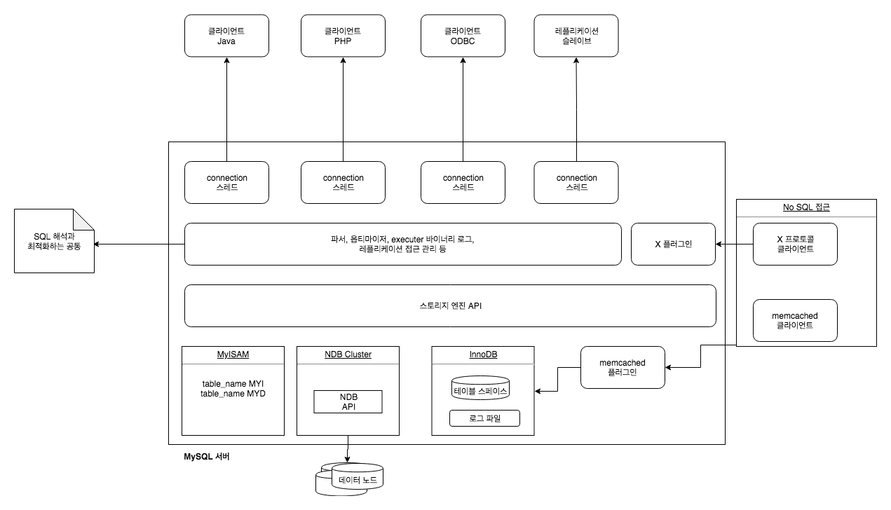
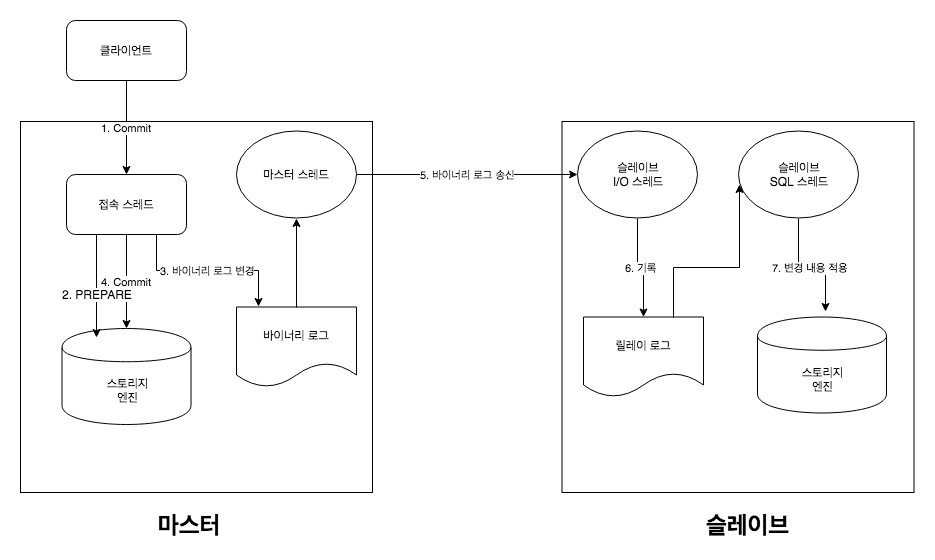
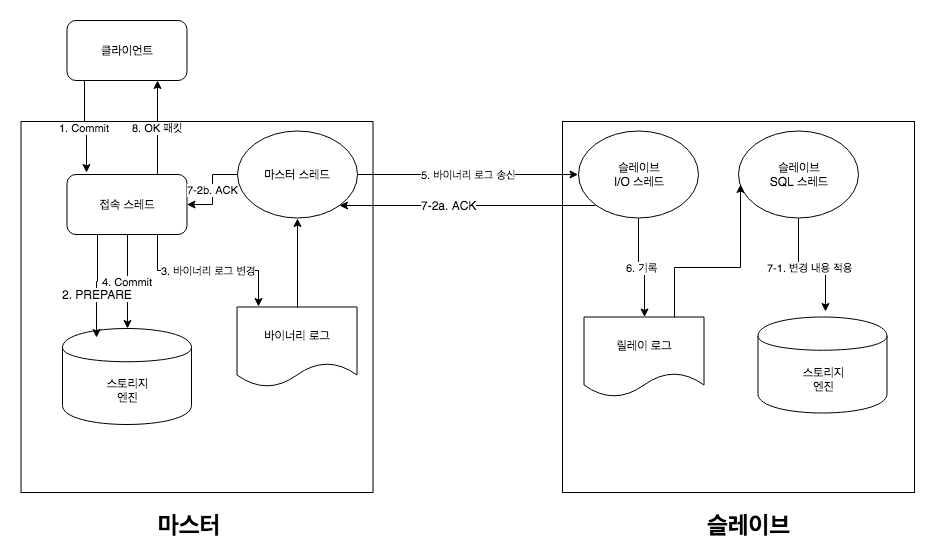

> 해당 글은 [MySQL 5.7 완벽 분석](http://www.yes24.com/Product/Goods/72270172?)을 정리한 내용입니다.





# 레플리케이션
MySQL에 국한된 것은 아니겠지만, 레플리케이션의 저변에 깔린 사고 방식은 아주 단순하다. **2개의 데이터베이스에 저장되는 데이터가 같고, 이 데이터에 가해진 변경도 같으면 결과도 같다** 는 것이다. 마스터에 일어난 변경을 연속적으로 기록해서 같은 변경을 슬레이브에 전송한다. 슬레이브에서 마스터에 보내욘 변경 이력을 연속으로 재생한다. 이렇게 하면 슬레이브의 데이터는 마스터를 따라가게 된다.



* 마스터의 변경을 기록하기 위한 바이너리 로그
* 슬레이브에 데이터를 전송하기 위한 마스터 스레드
* 슬레이브에서 데이터를 받아 릴레이 로그에 기록하기 위한 I/O 스레드
* 릴레이 로그에서 데이터를 읽어 재생하기 위한 SQL 스레드


MySQL은 이와같은 구조를 사용해 **비동기 레플리케이션을 구현하고 있다.** 비동기형은 마스터의 변경이 일어난 이후에 슬레이브에 변경 데이터를 전송해 마스터의 변경 시간과 상관없이 슬레이브에서 변경 내용을 적용하는 것을 말한다. **다시 말해 슬레이브 데이터는 마스터와 완전하게 동기화 되는 것이 아니라 약간의 시차를 두고 따라가게 되는 것이다.**

## 바이너리 로그
**바이너리 로그는 MySQL 서버에 발생한 모든 변경을 직렬화하여 기록한 파일이다.** MySQL 서버가 생성해 보관 중인 바이너로그의 정보는 바이너리 로그 인덱스 파일에 저장한다. 이 때 실제 존재하는 바이너리 로그 파일과 바이너리 로그 인덱스  파일의 내용은 반드시 같아야 한다. **바이너리 로그를 재생한다는 것은 그 SQL문을 순서대로 실행한다는 의미다.** 레플리케이션을 위해 바이너리 로그를 사용하는 경우에 한해 statement 기반 레플리케이션(SBR) 이라고 부른다. 

SRB의 문제점은 SQL 종류에 따라 실행 결과가 반드시 일치하지 않을 수 있다는 것이다. 대표적으로 UUID() 함수를 사용하는 경우가 대표적인 예다.

이와 같은 비결성 SQL문제를 극복하기 위해서 MySQL 5.1에서 row 기반 포맷, 또는 row 기반 레플리케이션 RBP 모드가 추가되었다 이는 말대로 SQL을 실행한 결과, **변경이 일어난 행의 변경 전후 값을 기록하는 방식이다.** 행 단위로 데이터를 기록하기 때문에 SBR에 비해 바이너리 로그 크키가 큰 결점이지만, SQL이 비결정성인지 아닌지에 대해 걱정할 필필요가 없다.

바이너리 로그에는 또 하나의 포맷이 존재한다. Mixed 기반 포맷, 또는 Mixed 기반 레플리케이션이 MBR 이다. 이는 SBR, RBR을 필요에 따라 나누어 사용하는 방식으로, **처음에는 SBR로 기록하다가 비결정성 SQL을 만나면 RBR 방식으로 기록한다. 따라서 비결정성 SQL로 인해 데이터 부정합성이 발생할 걱정이 없다.** 두 가지 장점을 모두 취한것이다. 


## 레플리케이션을 구성하는 스레드

### 마스터 스레드
**MySQL의 레플리케이션은 마스터가 서버이고 슬레이브가 클라이언트인 관계다.** 다시말하면, **레플리케이션을 위해 슬레이브가 마스터로 접속하는 형태다. 따라서 마스터는 슬레이브가 로그인하기 위한 계정이 필요하며, REPLICATION SALVE라는 권한을 부여 받아야 한다.**

마스터 스레드의 역할은 단 하나, 바이너리 로그를 읽어 슬레이브에게 전송 하는 것이다. 슬레이브는 단순한 클라이언트 가운데 하나로, 통상의 사용자 스레드와 어떤 차이도 없으면 로그인한 것만으로 슬레이브인지 아닌지 알 도리가 없다. 로그인 후 슬레이브가 바이너리 로그를 송신하도록 지시하고 나면 송신이 시작된다.

### 슬레이브 I/O 스레드
I/O 스레드는 마스터에 접속해 `COM_BINLOG_DUMP`, `COM_BINLOG_DUMP_GTID` 명령어로 마스터에서 연속적으로 갱신된 내용을 받으며, 받은 데이터를 릴레이 로그라는 로그파일에 보존한다.

### 슬레이브 SQL 스레드
슬레이브 SQL 스레드는 릴레이 로그에 기록된 갱신 내용을 읽어 들여 슬레이브에서 재생할 때 사용되는 스레드이다.

## 레플리케이션의 형태
MySQL 레플리케이션은 마스터-슬레이브형의 구성을 기본으로한다. 레플리케이션을 구성하기 위해서는 마스터에서 슬레이브로 바이너 로그를 보내서 슬레이브에서 재생하는 방식 구조를 충족하면 된다. 그 범위 내에 실로 다양한 레플리케이션 형태가 존재한다. 


## 레플리케이션 구축

### 마스터 설정

#### server_id 설정
MySQL 서버는 모두 공의 ID가 필요하다. server_id는 바이너리 로그에 기록된다. 그래야 바이너리 로그를 받은 슬레이브가 어떤 MySQL 서버가 변경의 발신처인지를 확인할 수 있기 때문이다.

#### 바이너리 로그 활성화
레플리케이션에서 바이너리 로그가 필수 항목이다.

#### 슬레이브 접속 계정 생성
REPLICATION SLAVE 권한을 가진 사용자를 슬레이브에서 로그인 가능한 상태로 설정 해야한다.

### 슬레이브로 데이터 복사
신규로 MySQL 서버를 설치하고, 동시에 레플리케이션을 설정하는 경우 데이터를 따로 복사할 필요가 없다. 하지만 **현존하는 MySQL 서버를 마스터로 하고 새로운 슬레이브를 추가하고 싶은 경우 마스터에서 슬레이브로 데이터를 복사해야 한다.**

먼저 마스터에서 백업을 하고 슬레이브에 복원을 한다. 백업을 하는 시점은 마스터에서 바이너 로그를 활성화한 이후여야한다. 

### 슬레이브 설정
마스터가 준비되면 슬레이브에서 마스터로 접속할 수 있다. 

#### server_id 설정
MySQL다른 서버와 중복되지 않은 공유한 server_id를 지정한다.

#### 레플리케이션 설정
레플리케이션 설정은 CHANGE MASTER 명령어로 할 수 있다.

```sql
mysql > CHANGE MASTER TO
    -> MASTER_HOST = '마스터 호스트명 또는 IP 주소',
    -> MASTER_PORT = 3306,
    -> MASTER_LOG_FILE = 'MYSQL-BIN.000777',
    -> MASTER_LOG_POS = 12345678
    -> MASTER_HEARTBEAT_PERIOD = 60;
```

## GTID의 진화
GTID는 바이너리 로그에 기록된 각각의 트랜잭션에 고유한 ID를 붙여주는 기능을 말한다.

```
발신서 MySQL 서버의 ID : 트랜잭션 ID
00018758-1111-1111-1111-11111111:1
```

트랜잭션 ID는 수의 범위로 표현하는 것도 가능하다. 예를 들어, 처음부터 9999번째까지의 일련의 트랜잭션에 1-9999와 같은 표기가 사용될 수 있다. GTID는 어떤 트랜잭션을 실행했는가를 이와 같은 트랜잭션 ID의 범위로 표현 가능하다.

**GTID는 1:N형의 레플리케이션에서 슬레이브의 자동 승격에 이용된다.** 어떤 문제로 인해 마스터를 더 이상 사용할 수 없게 된경우, 문제 없이 운영중인 슬레이브를 승격시켜 새로운 마스터로 사용하는 방법이다. GTID가 없는 5.5 이전 버전에서는 슬레이브의 승격이 굉장히 어려운 문제였다. 

슬레이브를 마스터로 승격시킬때 마스터로 승격시키려면 다음 두 가지가 필요하다.

1. 애플리케이션에서 변경할 대상의 서버 주소를 변경한다.
2. 새로운 승격된 마스터로부터 다른 슬레이브가 레플리케이션을 위해 변경 내용을 받는다.


**슬레이브가 여러 개 있다고 해도 슬레이브 사이에 어떤 연계가 있는 것은 아니다. 슬레이브는 각각의 마스터로부터 바이너리 로그를 받아 자기만의 페이스로 재생한다.**

혹시라도 I/O 스레드가 받은 바이너리 로그의 진행에 차이가 생기면 그 차이를 메우기 위한 작업이 매구 귀찮아진다. 왜냐하면 슬레이브 자신이 생성한 바이너리 로그와 마스터가 생성한 바이너리 로그 사이의 관계를 알려주는 정보가 없기 때문이다. **GTID가 있다면 바이너리 로그에 기록된 각각의 트랜잭션은 한번에 식별이 가능하므로 근본적으로 이와 같은 문제가 발생하지 않는다.**

## OK 패킷에 GTID
**MySQL의 레플리케이션은 비동기 레플리케이션이다.** 준동기 레플리케이션 모드도 있지만 이때도 동기화하는 것은 I/O 스레드까지로, **그 후 SQL 스레드가 바이너리 로그를 재생해 트랜잭션이 완료하기까지 기다리지 않는다. 그러므로 마스터에서 트랜잭션을 실행한 직후에 슬레이브에 질의하면 그 트랜잭션이 실행되기 전에 데이터만 참조하게 될 수도 있다.**

**마스터에서 커밋한 트랜잭션이 슬레이브에 전파되는 것을 기다렸다가 슬레이브에 질의하는 것**을 위해 고안된 것이 GTID를 사용해 트랜잭션이 전파되었지를 판단하는 방법이 고안되었다.

## 준동기 레플리케이션의 개선점
준동기 레플리케이션은 MySQL 5.5에서 추가된 기능으로, **마스터에서 일어난 변경이 슬레이브에 확실하게 전달되었는지를 보증하는 것을 말한다.** 준동기 레플리케이션도 버전이 올라가면서 계속 개선되어 MySQL 5.7에서는 사용이 꽤 편리해졌다.

### 준동기 레플리케이션이란
준동기 레플리케이션은 완전한 동기 레플리케이션은 아니다. 만일 완전한 동기 레플리케이션이 MySQL 서버에도 존재한다고 하면, 그것은 2단계 커밋을 의미한다. 2단계 커밋이란 PREPARE와 COMMIT의 두 단계로 나눈 것을 말한다.

준동기 레플리케이션은 전체 과정 중 어느 부분을 동기화하는 것인가? **마스터와 트랜잭션이 실행되면 COMMIT을 완료하기 전에 슬레이브 바이너리 로그의 전송을 완료함을 의미한다.**



준동기 레플리케이션에서 클라이언트에 COMMIT의 응답(4번의 응답)을 변환하기 전에 슬레이브에서 ACK(7-2a. ACK)가 반환되기를 기달린다. **7-1, 7-2a는 병렬로 실행되기 때문에 어느 쪽이 먼저 끝날지 모른다. 클라이언트에서 응답한 시점에 이미 슬레이브의 변경이 완료될 수도 있다. 하지만 완벽하게 같은 시기는 아니므로 동기라고 보증할 수 없다.**

엔진쪽에서 COMMIT이 일어나다. PREPARE가 완료한 시점에서 MySQL 서버가 손상될 경우, 재기동 후의 복구는 바이너리 로그에 트랜잭션이 남아 있다면 처음으로 COMMIT이 실행되며, 그렇지 않으면 트랜잭션 롤백을하게 된다. **다시 말해 바이너리 로그의 fsync 여부에 따라 변경 내용을 영속화할것인지 아닌지 결정하는 것이다.**