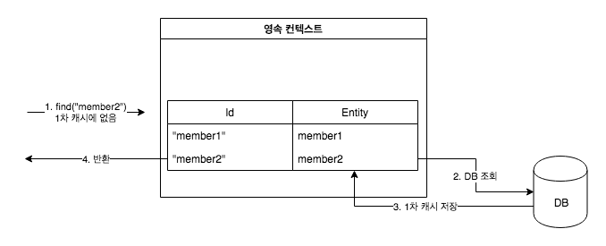

# 영속 성컨텍스트

## 영속성 컨텍스트의 특징

* 영속성 컨텍스트와 식별자 값 : 영속성 컨텍스트는 엔티티를 식별자 값(@Id)으로 구분한다. 따라서 **영속 상태는 식별자 값이 반드시 있어야한다.**
* 영속성 컨텍스트와 데이터베이스 저장 : JPA는 보통 트랜잭션을 커밋하는 순간 영속성 컨텍스트에 새로 저장된 엔티티를 데이터베이스에 반영하는데 이것을 **플러시**라 한다.
* 영속성 컨텍스트가 엔티티를 관리하면 다음과 같은 장점이 있다.
  * 1차 캐시
  * 동일성 보장
  * 트랜잭션을 지원하는 쓰기 지연
  * 변경 감지
  * 지연 로딩

## 엔티티 조회

### 1차 캐시 조회


`em.find()`를 호출하면 우선 1차 캐시에서 식별자 값으로 엔티티를 찾는다. 만약 찾는 엔티티가 있다면 데이터베이스를 조회하지 않고 메모리에 있는 1차 캐시에서 엔티티를 조회한다.

### 데이터베이스 조회



만약 `em.find()`를 호출했는데 엔티티가 1차 캐시에 없으면 엔티티 매니저는 데이터 베이스를 조회해서 엔티티를 생성한다. 그리고 1차캐시에 저장한 후에 영속성 산태의 엔티티를 반환한다.

1. `em.find(Member.class, "member2")`를 실행한다.
2. member2가 1차 캐시에 없음으로 데이터베이스에 조회한다.
3. 조회한 데이터로 member2 엔티티를 생성해서 1차 캐시에 저장한다.
4. 조회한 엔티티를 반환한다.

### 영속 엔티티의 동일성 보장

```java
Member a = em.find(Member.class, "member1");
Member b = em.find(Member.class, "member1");

System.out.println(a == b) // 동일성 비교 결과 : true
```
**영속성 컨텍스트는 1차 캐시에 있는 같은 엔티티 인스턴를 반환한다. 따라서 둘은 같은 인스턴스고 결과는 당연히 true이다. 영속성 컨텍스트는 성능상 이점과 엔티티의 동일성을 보장한다.**

## 엔티티 등록

```java
EntityMaanger em  = emf.createEnttiyManager();
ENtityTranscation transaction = em.getTransaction();
// 엔티티 매니저는 데이터 변경 시 트랜잭션을 시작해야한다.

transaction.begin();

em.persist(memberA);
em.persist(memberB);

// 여기까지 Insert SQL을 데이터베이스에 보내지 않는다.

// Commit을 하는 순간 데이터베이스에 Insert SQL을 보낸다
transaction.commit();
```
엔티티 매니저는 트랜잭션을 커밋하기 직전까지 데이터베이스에 엔티티를 저장하지 않고 내부 쿼리 저장소에 INSERT SQL을 모아둔다. 그리고 트랜잭션을 커밋할 때 모아둔 쿼리를 데이터베이스에 보내느데 이것을 트랜잭션을 지원하는 쓰기 지연 이라 한다.


회원 A를 영속화 했다. 영속성 컨텍스트는 1차 캐시에 회원 엔티티를 저장하면서 동시에 회원 엔티티 정보로 등록 쿼리를 만든다. 그리고 만들어진 등록 쿼리를 쓰기 지연 SQL 저장소에 보관한다.


다음으로 회원 B를 영속화했다. 마찬가지로 회원 엔티티 정보로 등록 쿼리를 생성해서 쓰지 지연 SQL 저장소에 보관한다. 현재 쓰기 지연 SQL저장소 에는 등록 쿼리가 2건이 저장되어 있다.


마지막으로 트랜잭션을 커밋했다. **트랜잭션을 커밋하면 엔티티 매니저는 우선 영속성 컨텍스트를 플러시한다. 플러시는 영속성 컨텍스트의 변경 내용을 데이터베이스에 동기화하는 작업인데 이때 등록, 수정, 삭제한 엔티티를 데이터베이스에 반영한다.**

즉, 쓰기 지연 SQL 저장소에 모인 쿼리를 데이터베이스에 보낸다. 이렇게 영속성 컨텍스트의 변경 내용을 데이터베이스에 동기화한 후에 실제 디이터베이스 트랜잭션을 커밋한다.

:bangbang:
flush가 먼저 동작하고 (데이터베이스에 동기화한 후에) 실제 데이터베이스 트랜잭션을 커밋한다.

### 트랜잭션을 지원하는 쓰기 지연이 가능한 이유

```
begin(); // 트랜잭션 시작

save(A);
save(B);
save(C);

commit(); // 트랜잭션 커밋
```

1. 데이터를 저장하는 즉시 등록 쿼리르 데이터베이스에 보냔다. 예제에서 save() 메서드를 호출할 때 마다 즉시 데이터베이스에 등록 쿼리를 보낸다. 그리고 마지막에 트랜잭션을 커밋한다.
2. 데이터를 저장하면 등록 쿼리를 **데이터베이스에 보내지 않고 메모리에 모아 둔다.** 그리고 트랜잭션을 커밋할 때 모아둔 등록 쿼리를 데이터베이스에 보낸다.

트랜잭션 범위 안에서 실행되므로 둘다 결과는 같다. A, B, C 모두 트랜잭션을 커밋하면 함께 저장되고 롤백하면 함께 저장되지 않는다. **등록 쿼리를 글떄 그때 데이터베이스에 전달해도 트랜잭션을 커밋하지 않으면 아무 소용이 없다.** 어떻게든 커밋 직전에만 데이터베이스에 SQL을 저장하면 된다. 이것이 트랜잭션을 지원하는 쓰기 지연이 가능한 이유다.

이 기능을 잘 활용하면 모아둔 등록 쿼리를 데이터베이스에 한 번에 전달해서 성능 최적화할 수 있다.

:bangbang:
1, 2이든 결국 commit 액션이 없으면 데이터베이스에 반영되지 않으니 쿼리를 한 번에 모아놓고 한 번에 전달하는 것이 차이다. 트랜잭션 단위는 1, 2 번 모두 동일하다.

## 엔티티 수정

### 수정 쿼리의 문제점
수정 쿼리는 비지니스 요구사항에 맞게 지속적으로 늘어난다 그리고 비지니스 로직을 분석하기 위해서는 SQL을 계속 확인해야한다. 결국 직접적이든 간접적이든 비지니스 로직이 SQL에 의존하게 된다.

### 변경 감지
```java
EntityMaanger em  = emf.createEnttiyManager();
ENtityTranscation transaction = em.getTransaction();
transaction.begin(); // 트랜잭션 시작

// 영성속 텐티티 조회
Member memberA = em.find(Member.class, "memberA");

// 영속성 엔티티 데이터 수정

memberA.setUsername("hi");
memberA.setAge(10);

//em.update(member) 이런 코드가 있어야하지 않을까?

transaction.commit(); // 트랜잭션 커밋
```

JPA로 엔티티를 수정할 때는 단순히 엔티티를 조회해서 데이터만 변경하면 된다. `emm.update` 같은 메서드를 실행해야할거 같지만 이런 메서드는 없다. **엔티티의 변경사항을 데이터베이스에 자동으로 반영하는 기능을 변경 감지(dirty checking) 이라 한다.**
