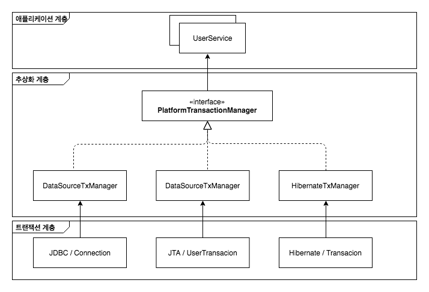

> [토비의 스프링](http://www.yes24.com/Product/goods/7516721)을 보고 정리한 자료입니다.

# 트랜잭션 동기화

트랜잭션 처리에 필요한 Connection 객체를 계속 메소드의 파라미터로 전달(싱글톤 객체는 멤버 필드를 공유하면 안되기 때문)하다가 DAO를 호출할 때 사용하는 것을 피하기 위해서 스프링이 제안하는 방법은 **트랜잭션 동기화** 이다. 

트랜잭션 동기화란 `UserService`에서 트랜잭션을 시작하기 위해 만든 Connection 오브젝트를 특별한 저장소에 보관해두고, 이 후에 호출되는 DAO의 메소드에서는 저장된 Connection을 가져다가 사용하게 하는 것이다. 정확히는 DAO가 사용하는 JdbcTemplate이 트랜잭션 동기화 방식을 이용하도록 하는 것이다. 그리고 트랜잭션이 모두 종료되면, 그 때는 동기화를 마치면 된다.

## 트랜잭션 동기화 작업 흐름

* (1) UserService Connection을 생성하고
* (2) 이를 트랜잭션 동기화 저장소에 저장해두고 connection의 SetAutoCommit(false)를 호출해 트랜잭션을 시작시킨 후에 본격적으로 DAO의 기능을 이용하기 시작한다.
* (3) 첫 번째 `update()` 메서드가 호출되고 `update()` 메서드 내부애서 이용하는 JdbcTemplate 메서드에 가장 먼저 (4) 트랜잭션 동기화 저장소에 현재 시작된 트랜잭션을 가진 Connection 객체가 존재하는지 확인한다.
* (2) `upgradeLevels()` 메서드 시작 부분에서 저장해둔 Connection을 발견 하고 이를 가져온다.
* 가져온 (5) Connection을 이용해서 PreparedsStatment를 만들어 수정 SQL을 실행한다.
* 트랜잭션 동기화 저장소에서 DB 컨넥션을 가져왔을 때는 JdbcTemplated은 Connection을 닫지 않은 채로 작업을 마친다.
* 이렇게 해서 첫 번째 DB 작업을 마쳤다. 여전히 Connection은 열려 있고 트랜잭션은 진행 중인 채로 트랜잭션 동기화 저장소에 저장되어 있다.
* (6) 두 번째 `update()`가 호출되면 이때도 마찬가지로 (7) 트랜잭션 동기화 저장소에서 Connection을 가져와 (8) 사용한다. (9) 마지막 `update()`도 (10) 같은 트랜잭션을 가진 Connection을 가져와 (11) 사용 한다.
* 트랜잭션 내의 모든 작업이 정상적으로 끝났으면 UserService는 이제 (12) Connection의 commit()을 호출해서 트랜잭션을 완료시킨다.
* (13) 트랜잭션 저장소가 더이상 Connection 객체를 저장해두지 않도록 이를 제거한다.
* 어느 작업 중에라도 예외상황이 발생하면 UserSErvice는 즉시 Connection의 `rollback()`을 호출 하고 트랜잭션을 종료할 수 있다.

트랜잭션 동기화 저장소는 작업 스레드마다 독립적은올 Connection 객체를 저장하고 관리하기 때문에 다중 사용자를 처리하는 서버의 멀티스레드 환경에서 충돌이 날 염려는 없다.

트랜잭션 동기화 긱법을 사용하면 파라마터를 통해 일일이 Connection 개체를 전달할 필요가 없어진다. 트랜잭션 경계설정이 필요한 `upgradeLevles()`에서만 Connection을 다루게 하고, 여기서 생성된 Connection과 트랜잭션을 DAO의 JdbcTemplate이 사용할 수 있도록 별도의 저장소에 동기화하는 방법을 적용하기면 된다.

## 트랜잭션 전이 메커니즘
JdbcTemplate는 영리하게 동작하도록 설계되어 있다. 만약 미리 생생돼서 트랜잭션 동기화 저장소에 등록된 **DB 컨넥션이나 트랜잭션이 없는 경우 JdbcTemplate이 직접 DB 컨넥션을 만들고 트랜잭션을 시작해서 JDBC 작업을 진행한다.**

반면에 `upgradeLebles()` 메서드에서처럼 트랜잭션 동기화를 시작해 놓았다면 그때 부터는 실행되는 **JdbcTemplate의 메서드에서는 트랜잭션 동기화 저장소에 들어있는 DB 컨넥션을 가져와서 사용한다. 이를 통해 이미 시작된 트랜잭션에 참여하는 것이다.**

## 글로벌 트랜잭션 
여러개의 데이터베이스 사용하는 경우 **하나의 트랜잭션 안에서 여러 개의 DB에 데이터를 넣는 작업을 해야한다.**

한 개의 이상의 DB로의 작업을 하나의 트랜잭션으로 만든건 JDBC Connection을 이용한 트랜잭션 방식인 로컬 트랜잭션으로는 불가능하다. 로컬 트랜잭션은 하나의 DB Connection에 종속되기 때문이다. **따라서 별도의 트랜잭션관리자를 통해 트랜잭션을 관리하는 글로벌 트랜잭션 방식을 사용해야 한다.**

자바는 JDBC 외에 이런 글로벌 트랜잭션을 지원하는 **트랜잭션 매니저를 지원하기 위한 API인 JTA (Java Transacion API)를 제공하고 있다.**

트랜잭션은 JDBC나 JMS API를 사용해서 직접 제어하지 않고 JTA를 통해 트랜잭션 매니저가 관리하도록 위임한다. **하나 이상의 DB가 참여하는 트랜잭션을 만들려면 JTA를 사용해야 한다.**

## 스프링 트랜잭션 서비스 추상화

UserService의 코드가 특정 트랜잭션 방법에 의존적이지 않고 독립적일 수 있게 하려면 어떻게 해야할까? UserSerivce의 메서드 안에서 트랜잭션 경계설정 코드를 제거할 수는 없다. 하지만 특정 기술에 의존적인 Connection, UserTransaction, Session/Transaction API 등에 종속되지 않게 할 수 있는 방법은 있다. 

트랜잭션 경계설정을 담당하는 코드는 일정한 패턴을 갖는 유사한 구조다. 이렇게 여러 기술의 사용 방법에 공통점이 있다면 추상화를 생각해볼 수 있다.

**스프링은 트랜잭션 기술의 공통점을 담은 트랜잭션 추상화 기술을 제공하고 있다.** 이를 이요하면 애플리케이션에서 직접 각 기술의 트랜잭션 API를 사용 하지 않고도, 일관된 방식으로 트랜잭션을 제어하는 트랜잭션 경계설정 작업이 가능해진다.

JDBC를 이용하는 경우 Connection을 생성하고 나서 트랜잭션을 시작했다. 하지만 PlatformTransactionManager에서 트랜잭션을 가져오는 요청인 getTransacion() 메서드를 호출하기만 하면된다. 필요에 따라 트랜잭션 매니저가 DB 커넥션을 가져오는 작업도 같이 수행하기 때문이다. 트랜잭션을 가져온다는 것은 일단 트랜잭션을 시작한다는 의미라거 생각하자.

이렇게 시작된 트랜잭션은 TransactionStatus 타입의 변수에 저장된다. TransactionStatus는 트랜잭션에 대한 조직이 필요할 때 PlatformTransactionManager 메서드의 파라미터로 전달해주면 된다.

### 여기서 중요!
트랜잭션이 시작됐으니 이제 JdbcTemplate를 사용하는 DAO를 시용하는 작업은 진행한다. 스프링의 트랜잭션 추상화 기술은 앞에서 적용해봤던 트랜잭션 동기화를 사용한다. PlatformTransactionManager로 구현한 DataSourceTransactionManager의 객체는 JddbcTemplate에서 사용될 수 있는 방식으로 트랜잭션을 관리해준다. **따라서 PlatformTransactionManager를 통해 시작된 트랜잭션은 UserDao의 JdbcTemplate 안에서 사용된다.**

