# 따라하며 배우는 도커와 CI 환경

# 도커 기본
## 도커를 무엇인가요?

**컨테이너**를 사용하여 응용프로그램을 더 쉽게 만들고 배포하고 실행할 수 있도록 설계된 도구 이며 **컨테이너** 기반의 오픈소스 가상화 플램폼이며 생톄계 입니다.

## 도커 이미지와 컨테이너 정의 간단히 살펴보기


컨테이너는 코드와 모든 종속성을 패키지화하여 응용 프로그램이한 컴퓨팅 환경에서 다른 컴퓨팅 환경으로 빠르고 안정적으로 실행되도록 하는 소프트웨어의 표준 단이다.

**컨테이너 이미지는 코드, 런타임, 시스템 도구, 시스템 라이브러리 및 설정 과 같은 응용 프로그램을 실행하는 데 필요한 모든 것을 포함하는 가볍고 독립적이며 실행 가능한 소프트웨어  패키지입니다.**


1. 먼저 도커 CLI에 커맨드를 입력한다
2. 그러면 도커 서버 (도커 Deamon)이 그 커멘드를 받아서 그것에 따라 이미지를 생성하든 컨테이너를 생성하든 모든 작업을 하게 된다.


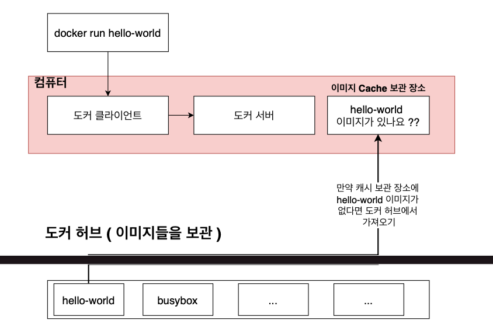

1. 도커 클라이언트에 커맨드를 입력하면 클라이언트에서 도커 서버로 요청을 보냄
2. 서버에서 hello-world라는 이미지가 이미 로컬에 cash가 되어 있는지 확인
3. 현재는 없기 때문에 `Unable to find image ~`라는 문구 출력
4. 없는 경우 Docker Hub이라는 이미지가 저장 되어 있는 곳에 가서 그 이미지를 가져오고 로컬에 Cash로 보관한다.
5. 그 후 이제는 이미지가 있으니 그 이미지를 이용해 컨테이너를 생성한다.
6. 그리고 이미지로 생성 된 컨테이너 이미지에서 받은 설정이나 조건에 따라 프로그램을 실행한다.

## 도커와 기존의 가상화 기술과의 차이를 통한 컨테이너 이해

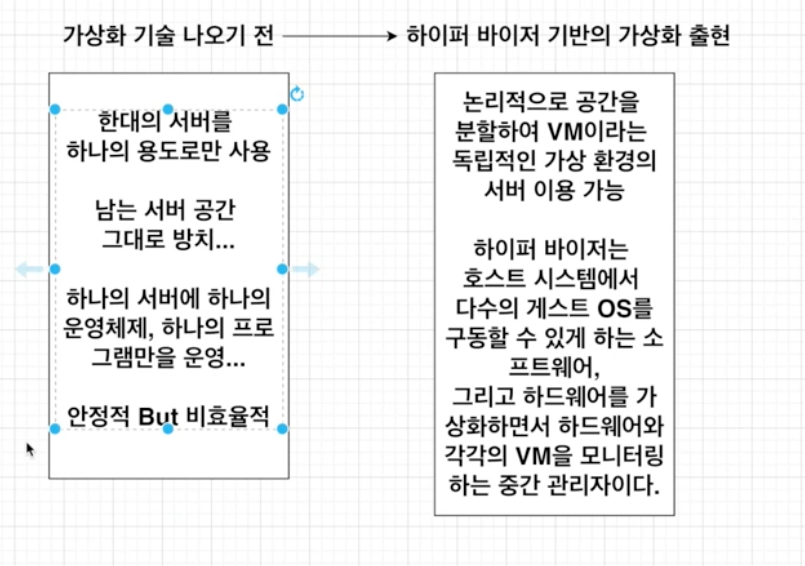


### 하이버 바이저 기반의 VM 구조


하이퍼바이저에 의해 구동되는 VM은 각 VM 마다 독립적 가상 하드웨어 지원을 할당 받습니다. 논리저긍로 분리 되어 있어 한 VM에 오류가 발행해도 다른 VM으로 퍼지지 않는다는 장점이 있습니다.

### 컨테이너 가상화 기술

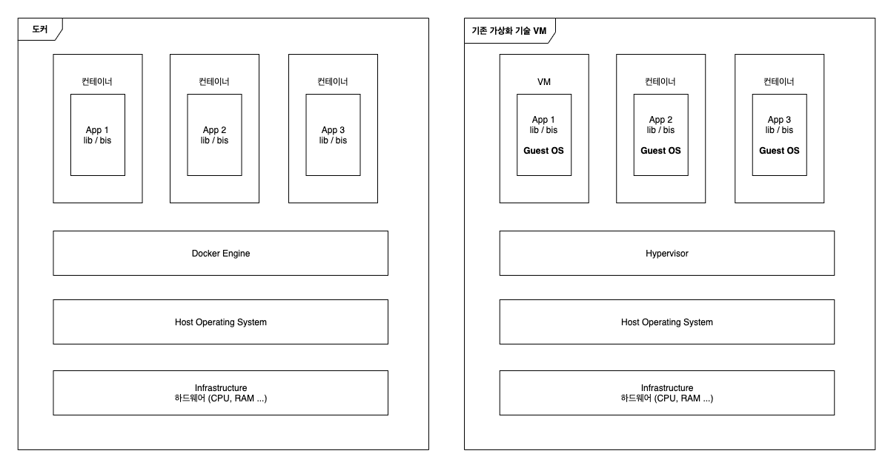

* VM과 비교했을 때 컨테이너는 하이버 바이저와 게스트 OS가 필요허지 않아 더 가볍습니다.
* 애플리케이션을 실행할 때는 컨테이너 방식에는 호스트 OS위에 애플리케이션의 실행 패키지인 이미지를 배포하기만 하면되는데, VM은 애플리케이션을 실행 하기 위해서 VM 띄우고 자원을 할당한 다음, 게스트 OS를 부팅하여 애플리케이션을 실행 해야 해서 훨 씬 복잡하고 무겁게 실행을 해야 합니다.
* 공통점: 도커 컨테이너와 가상 머신은 기본 하드웨어서 격리된 환경 내에 애플리케이션을 배치하는 방법입니다.
* 차이점: 가장 큰 차이점은 격리된 환경을 얼마나 격리를 시키는지의 차이


#### 도커 컨테이너

도커 컨테이너에서 돌아가는 애플리케이션은 컨테이너가 제공하는 격리 기능 내부에 샌드박스가 있지만, **여진히 같은 호스트의 다른 컨테이너와 동일한 커널을 공유 한다.** 결과적으로, 컨테이너 내부에서 실행되는 프로세스는 호스트 시스템(모든 프로세스를 나열할 수 있는 충분한 권한이 있음)에서 볼 수 있다.
예를 들어 도커와 함께 몽고DB 컨테이너를 시작한다면 호스트의 일반 쉘에서 `ps -e grep` 몽고를 실행하면 프로세스가 표시 됩니다. 또한 컨테이너 전체 OS를 내장할 필요가 업슨 결과, 도커는 매우 가볍습니다. (일반적으로 5~100 MB)

#### 가상 머신

가상 머신과 함께 VM 내부에서 실행되는 모든 것은 호스트 운영 체제 또는 하이퍼바이저와 독립되어 있ㄱ다. 가상 머신 플랫폼은 특정 VM에 대한 가상화 프로세스를 관리하기 위해 프로세스를 시작하고, 호스트 시슽젬은 그것의 하드웨어 자원의 일부를 VM에 할당한다. **그러나 VM은 근본적으로 다른 것은 시작에 이 VM 환경을 위해 새롭고 이 특정 VM만을 위한 커널 을 부팅하고 운영 체제 프로세스 세트를 시작한다는 것이다.** 이것은 응용 프로그램만 포함하는 일반적인 컨테이너보다 VM의 크기를 훨씬 크게 만든다. 이라한 이유 때문에 도커 보다 느리다.


### 도커 컴퓨터에 실행되고 있는 프로세스들


* 각 컨테이너 환경에 필요한 것들을 격리 시킴
* 컨테너를 격리 시키 때  리눅스 커널에서 쓰이는 **Cgroup(Control Groups)과 네임스페이스(namespaces)에 의해서 컨테이너와 호스트에서 실행되는 다른 프로세스 사이에벽을 만들게 된다.**

#### C Group

* CPU, 메모리, Network BrandWith, HD i/o 등 프로세스 그룹의 시스템 리소스 소용량을 관리
* 어떤 애플리케이션이 사용량이 너무 많다면 그 애플리케이션 같은 것을 C Group에 집어 넣어 CPU와 메모리를 제한 가능 기능

#### 네임스페이스
* 하나의 스스템에서 프로세스를 격리시킬 수 있는 가상화 기술
* 별개의 독립된 공간을 사용하는 것처럼 격리된 환경을 제공하는 경량 프로세스 가상화 기술

## 이미지로 컨테이너 만들기

전 강의들에서 이미지를 이용해서 컨테이너를 생성한다고 배웠습니다. 하지만 어떻게 해서 이미지를 이용해 컨테이너를 생성하는지는 다루지 않았기 때문에 이번 시간에 어떻게 컨테이너가 생성이 되게 되는지 자세히 알아보겠습니다. 

### 시작하기 전에 기억해야 할 것
이미지는 응용 프로그램을 실행하는데 **필요한 모든 것**을 포함 하고 있습니다.

1. 컨테이너가 시작 될 때 실행되는 명령어 ex) run application
2. 파일 스냅샷 ex) 애플리케이션을 실행하기 위한 파일

#### 이미지로 컨테이너 먼드는 순서

##### 1. Docker 클라이언트에 `docker run <이미지>` 입력


##### 2. 도커 이미지에 있는 파일 스냅샷을 컨테이너 하드 디스크에 옯겨 줍니다.
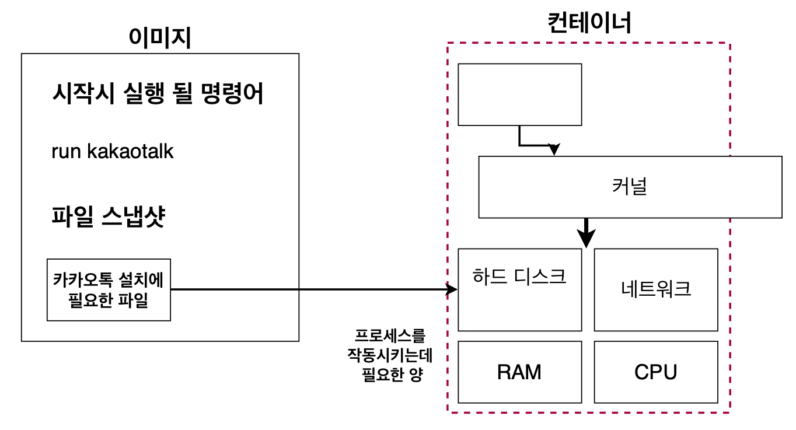


##### 3. 이미지에 가지고 있는 명령어(컨테이너가 실행될 때 사용될 명령어)를 이용해서 카카오톡을 실행 시켜줍니다.
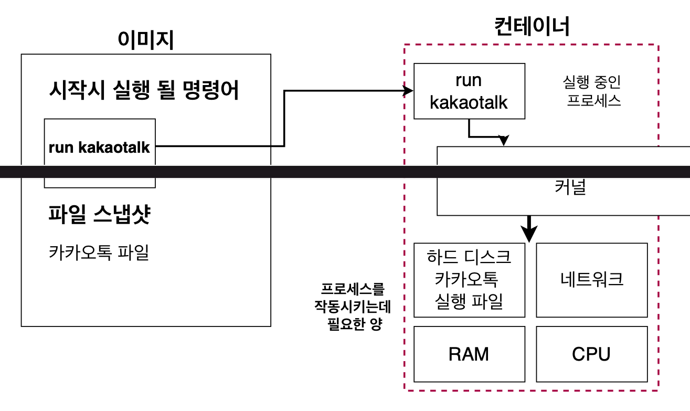


###### 4. 프로세스 실행
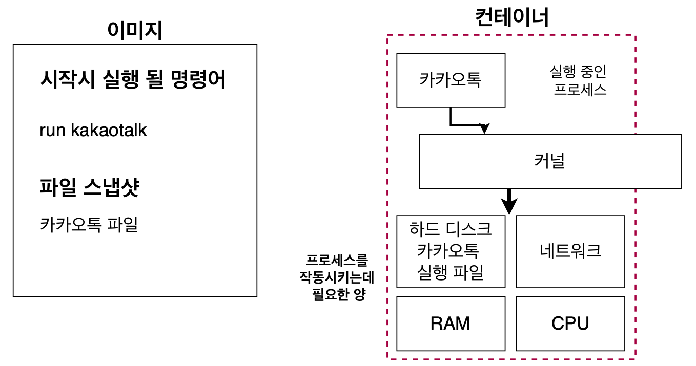


## C-group, 네임스페이스를 도커 환경에서 쓸 수 있는 이유

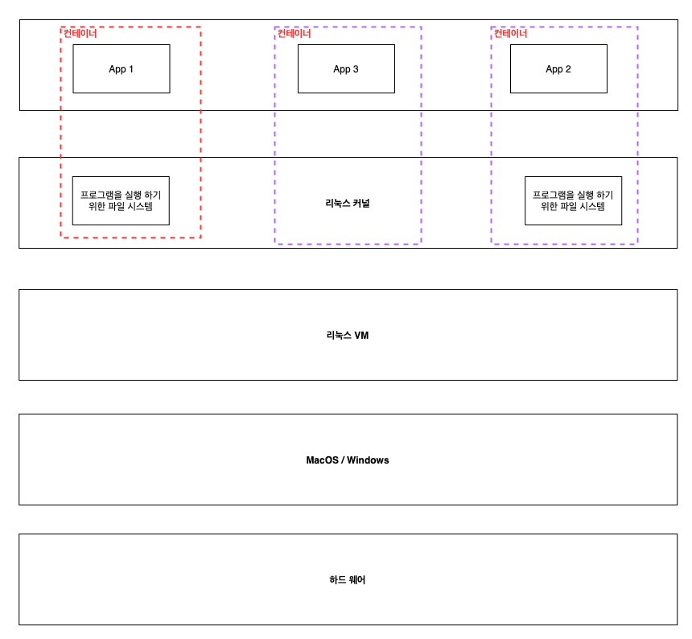

```
$ docker -version
Client: Docker Engine - Community
 Cloud integration: 1.0.4
 Version:           20.10.0
 API version:       1.41
 Go version:        go1.13.15
 Git commit:        7287ab3
 Built:             Tue Dec  8 18:55:43 2020
 OS/Arch:           darwin/amd64
 Context:           default
 Experimental:      true

Server: Docker Engine - Community
 Engine:
  Version:          20.10.0
  API version:      1.41 (minimum version 1.12)
  Go version:       go1.13.15
  Git commit:       eeddea2
  Built:            Tue Dec  8 18:58:04 2020
  OS/Arch:          linux/amd64
  Experimental:     false
 containerd:
  Version:          v1.4.3
  GitCommit:        269548fa27e0089a8b8278fc4fc781d7f65a939b
 runc:
  Version:          1.0.0-rc92
  GitCommit:        ff819c7e9184c13b7c2607fe6c30ae19403a7aff
 docker-init:
  Version:          0.19.0
  GitCommit:        de40ad0
```


내부적으로는 리눅스 커널을 사용하기 때문에 리눅스 커널의 C-group, 네임스페이스의 기술을 그대로 사용할 수 있다.

# 기본적인 도커 클라이언트 명령어 알아보기

## 도커 이미지 내부 파일 구조 보기

### docker run hello-word

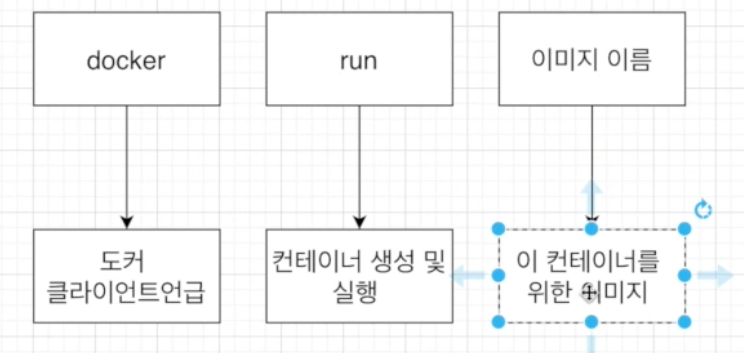

* docker run <이미지 이름>의 순서로 실행된다.

### 이미 내부 파일 시스템 구조 보기

#### docker run alpine ls

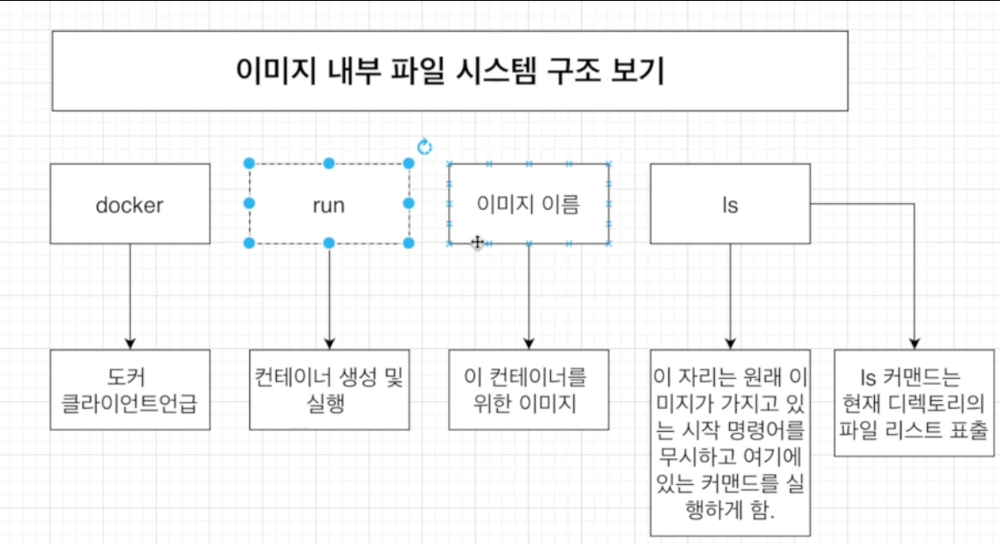

```
docker run alpine ls
rdocke
Unable to find image 'alpine:latest' locally
latest: Pulling from library/alpine
ba3557a56b15: Already exists
Digest: sha256:a75afd8b57e7f34e4dad8d65e2c7ba2e1975c795ce1ee22fa34f8cf46f96a3be
Status: Downloaded newer image for alpine:latest
bin
dev
etc
home
lib
media
mnt
opt
proc
root
run
sbin
srv
sys
tmp
usr
var
```
1. Alpine 이미지를 이용해 컨테이너를 생성
2. 생성 할때 Alpine 이미지 안에 들어있던 파일 스냡셧들 (bin, dev, etc...)이 컨테이너안에 있는 하드 디스크로 다운됨
3. 이미지 이름 뒤에 다른 명령어를 더 븉여서 이미지 안에 들어 있는 기본 커매드를 무시가 되고 ls 명령어가 실행됨

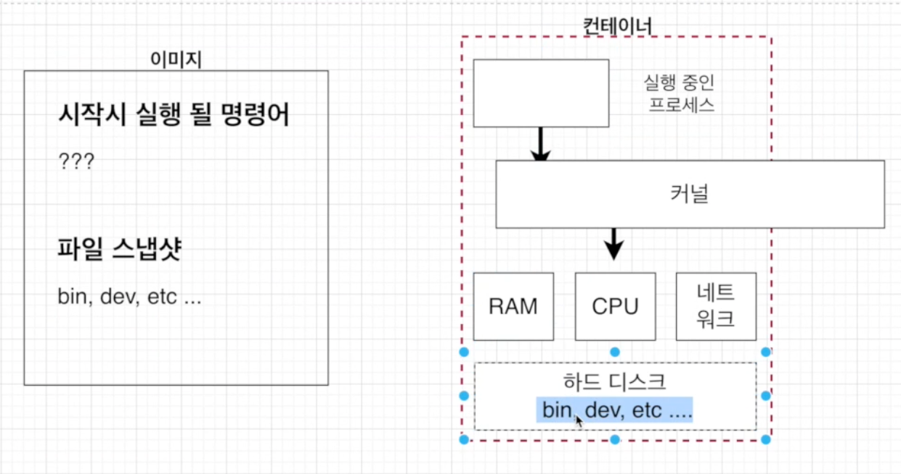

* 컨테이너 명령어 ls를 전달

## 컨테이너들 나열하기

### 현재 실행중인 컨테이너 나열

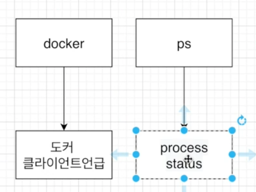


```
$ docker run alpine ping localhost

$ docker ps
CONTAINER ID   IMAGE     COMMAND                  CREATED         STATUS         PORTS                    NAMES
387514bc2f95   alpine    "ping localhost"         4 seconds ago   Up 3 seconds                            epic_goldstine
```

CONTAINER ID | IMAGE | COMMAND | CREATED | STATUS | PORTS | NAMES
-------------|-------|---------|---------|--------|-------|------
컨테이너의 고유한 해쉬값 | 컨테이너 생싱시 사용한 도커 이미지 | 컨테이너 시작시 실행될 명령어 | 컨테이너가 실행된 시간 | 컨테이너의 상태, 실행중 Up, 종료 Existed, 일시정지 Pause | 컨테이너가 개발한 포트와 호스트에 연결한 포트(설정하지 않으면 표시 하지 않음) | 컨테이너의 고유한 이름, 생성시 `--name` 옵션으로 이름을 설정하지 않으면 도커 엔진이 임의로 형용사와 명사를 조합해서 설정


### 모든 컨테이너 나열
docker ps -a


## 도커 컨테이너의 생명주기

### 생명주기


#### Docker run

* docker create <이미지 이름>
* docker start <이미지 이름>

* docker run은 create, start를 동시에 하는 진행

##### docker create <이미지 이름>

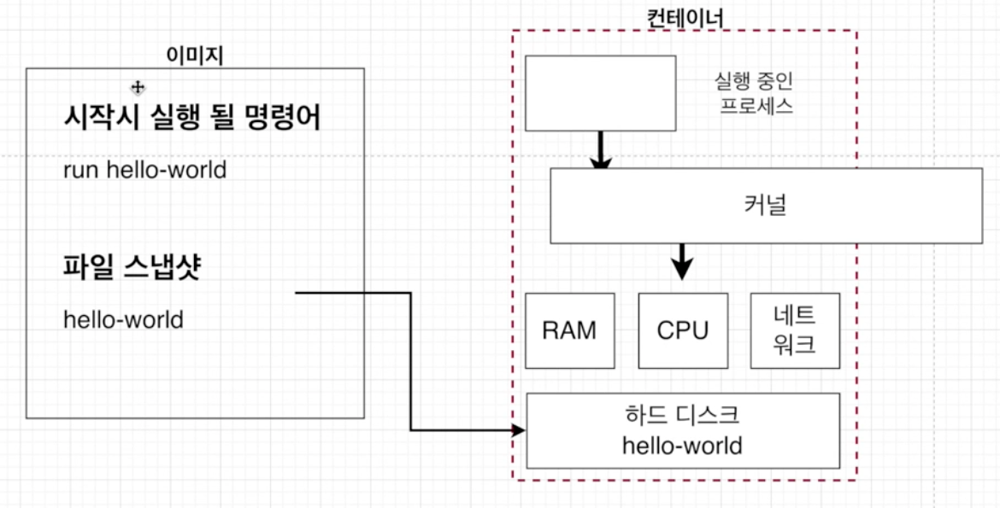

* 이미지를 생성하면 파일 스냅샷을 컨테이너 하드 디스크에 넣어 준다.

#### docker start <컨테이너 아이디/이름>

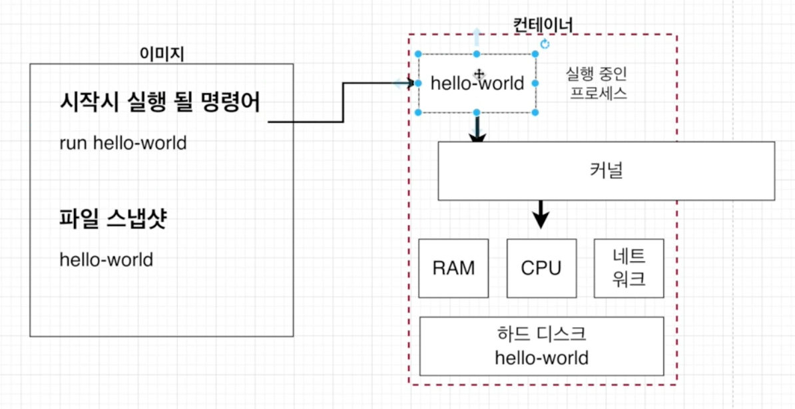

* 시작시 시잘될 명령어를 컨테이너에게 전달

## Docker Stop vs Docker Kill

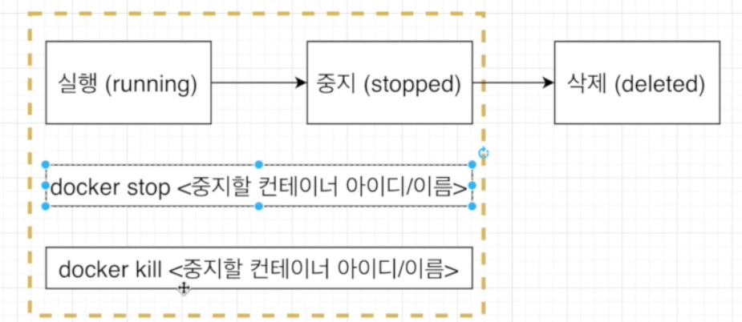

### Stop과 Kill은 어떤 차이가 있을 까?

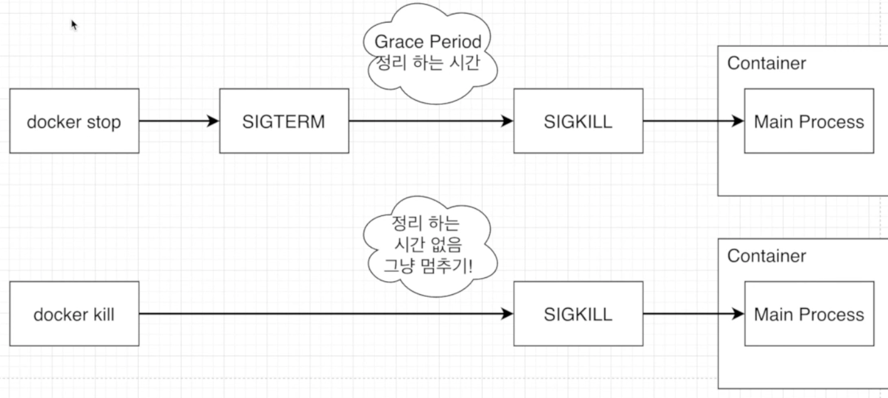

공통점은 컨테이너를 중지시킵니다. 하지만 stop은 `Gracefull` 하게 중지시킵니다. 작업이 진행되고 있다면 완료를 하고 컨테이너를 중지 시킵니다. 하지만 kill은 Steop과 달리 어떠한 것도 기다리지 않고 바로 컨테이너를 중지 합니다.


## 컨테이너 삭제하기

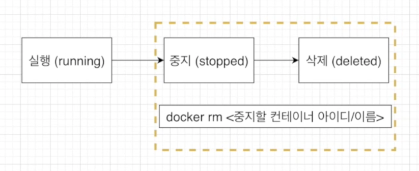

```
docker rm `docker ps -a -q` # 모든 컨테이너를 삭제
docker system prune # 한번에 컨테이너, 이미지, 네트워크 모두 삭제
```

## 실행 중인 컨테이너에 명령어 전달

### 이미 실행중인 컨테이너에 명령어를 전달하고 싶다면?
docker exsec <컨테이너 아이디>

```
docker run alpine ping localhost

docker exec 11d1ed909b32 ls
```
docker run은 새로 컨테이너를 만들어 실행, docker exec은 이미 실행 중인 컨테이너에 명령어 전달

## 레디스를 이용한 컨테이너 이해

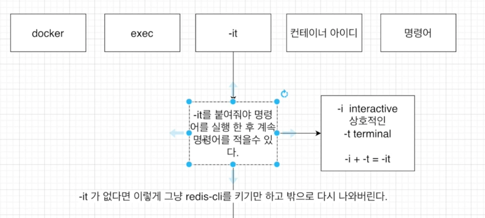

* `-it` 가 없다면 그냥 redi-cli만 키고 밖으로 나와 버린다.

## 실행 중인 컨테이너에서 터미널 생활 즐기기

### 컨테이너 쉘 환경으로 접속해 보기

1. 먼저 터미널 실행한 후 앞라인 이미지를 이용해 컨테이너를 실행합니다. docker run alpine
2. 이후 다른 터미널 실행후, 마지막 명령어 부분에 `sh`를 입력후 컨테이너 안에서 터미널 환경 구축 ex) `docker exsec -t <컨테이너ID> sh`
3. 그 안에서 여러가지 터미널에서 원래 할 수 있는 동작이 가능


# 직접 도커 이미지를 만들어 보기


현재까지는 도커 이미지를 항상 도커 허브에 이미 있던것들만 가져와서 사용했습니다. 하지만 저희가 직접 도커 이미지를 만들어서 사용할수 있고 직접 만든 도커 이미지를 도커허브에 올려서 공유할수도 있습니다. 도커 이미지를 직접 만들어 보는 방법을 알아보겠습니다.

## 도커 이미지 생성하는 순서


## Dockerfile 만드는 방법

### 도커 파일 이란 ?
도커 이미지를 만들기 위한 설정 파일이며, 컨테이너가 어떻게 행동해야 하는지에 대한 설정들을 정의해 주는 곳 입니다.

### 도커 파일 만드는 순서
1. 베이스 이미지를 명시해 준다 (파일 스냅샷에 할당)
2. 추가적으러 필요한 파일을 다운 받기 위한 몇가지 명령어를 명시해준다.(파일 스냅샷에 해당)
3. 컨테이너 시작시 실행 될 명령어를 명시해준다. (시작시 힐행될 명령어)

> 베이스 이미지는 무엇인가?
> 도커 이미지는 여러개의 레이어로 되어있다. 그중에서 베이스 이미지는 이 이미지의 기반이되는 부분이다.

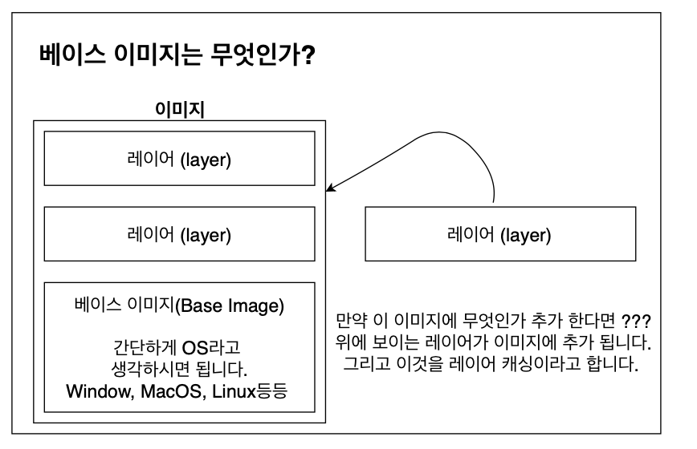


```
# 이미지를 생성시 기반이 되는 이미지 레이어
FROM alpine

# 도커 이미지가 생성되기 전에 수행할 쉘 명령어
RUN command

# 컨테이너가 시작되었을 때 실행할 실행 파일 또는 셀 스크립트
CMD ["echo", "hello"]
```

```
$ docker build ./   
Sending build context to Docker daemon  23.04kB
Step 1/2 : FROM alpine
 ---> 28f6e2705743
Step 2/2 : CMD ["echo", "hello"]
 ---> Running in 7a8a988759d4
Removing intermediate container 7a8a988759d4
 ---> 07573d69536a
Successfully built 07573d69536a

```

### Docker 이미지를 만드는 과정
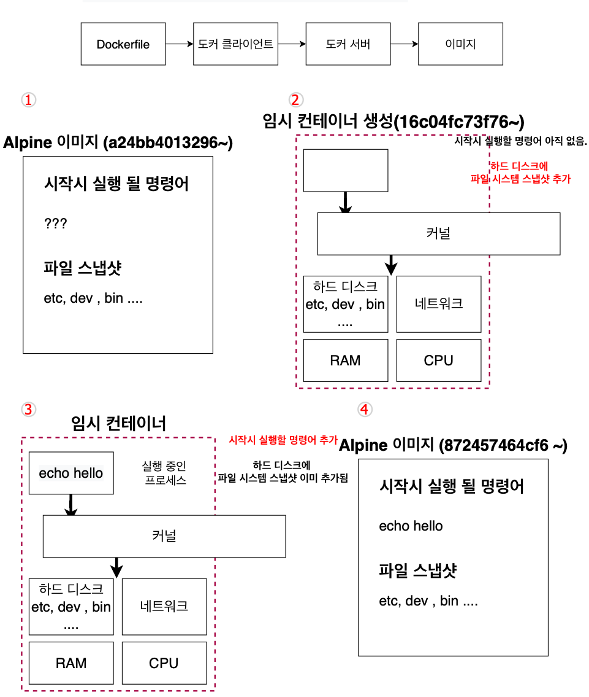


### 결론
베이스 이미지에서 다른 종속성이나 새로운 커맨드를 추가할 떄는 임시 컨테이너를 만든 후 그 컨테이너를 토대로 새로운 이미지를 만든다. 그리고 임시 컨테이너를 지워 준다.

## 내가 만든 이미지 기억하기 쉬운 이름 주기


```
$ docker build -t cheese10/hello-test:latest .
Alias tip: dk build -t cheese10/hello-test:latest ./
Sending build context to Docker daemon  23.04kB
Step 1/2 : FROM alpine
 ---> 28f6e2705743
Step 2/2 : CMD ["echo", "hello"]
 ---> Using cache
 ---> 07573d69536a
Successfully built 07573d69536a
Successfully tagged cheese10/hello-test:latest
```

# 도커를 이용한 간단한 Node.js 어플 만들기

## 섹션 설명

## package.json이 없다고 나오는 이유

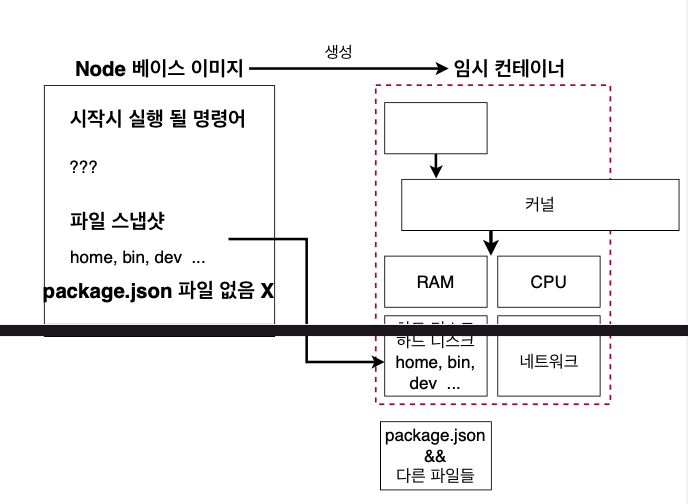

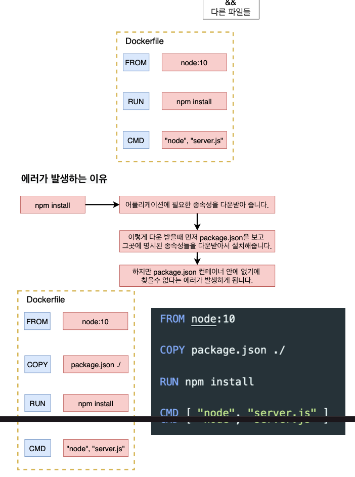

```
FROM node:10

RUN npm install

CMD ["node", "server.js"]
```


## 생성한 이미지로 어플리케이션 실행 시 접근이 안되는 이유(포트 매핑)

### 컨티이너 포트 매핑


## Woking Directory 명시해주기

이미지 안에서 어플리케이션 소스 코드를 가지고 있을 디렉토리르 생성하는 것 그리고 이 디렉토리가 어플리케이션에 working directroy가 됩니다.


## Volume


