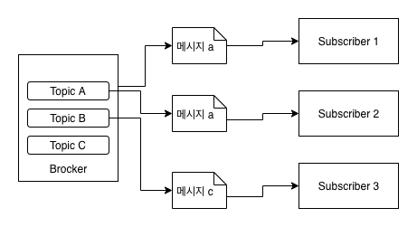
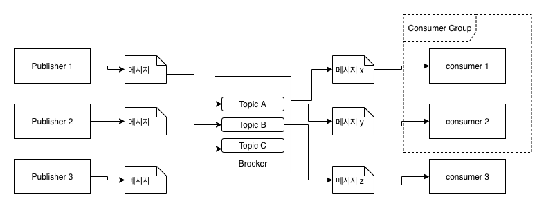
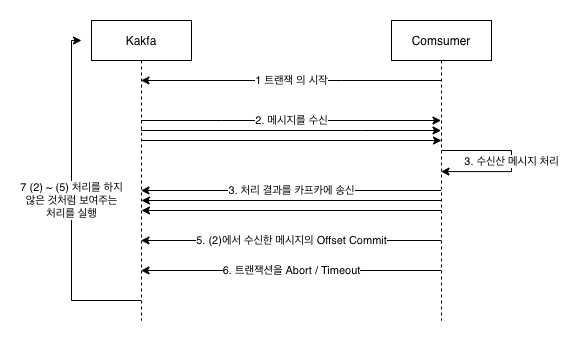
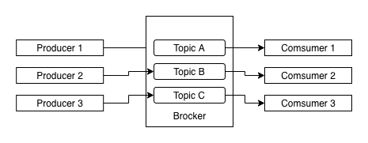
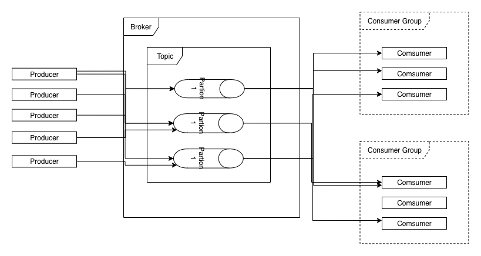
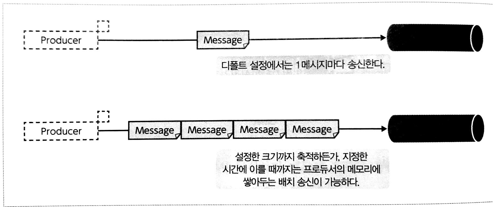
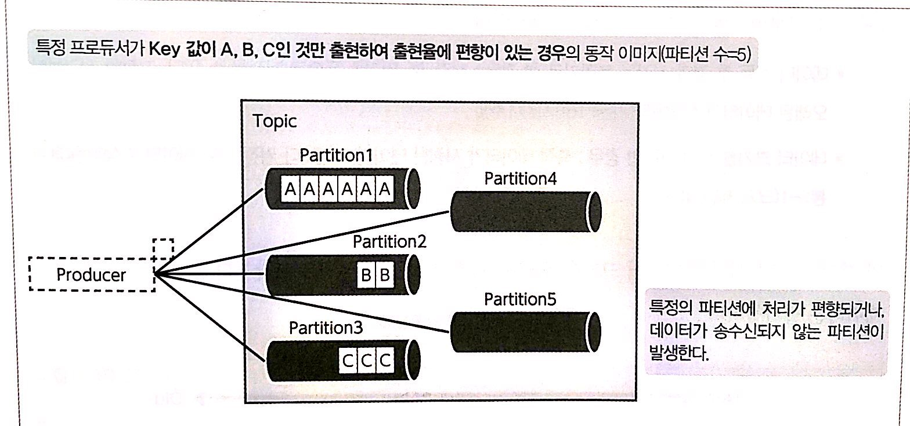
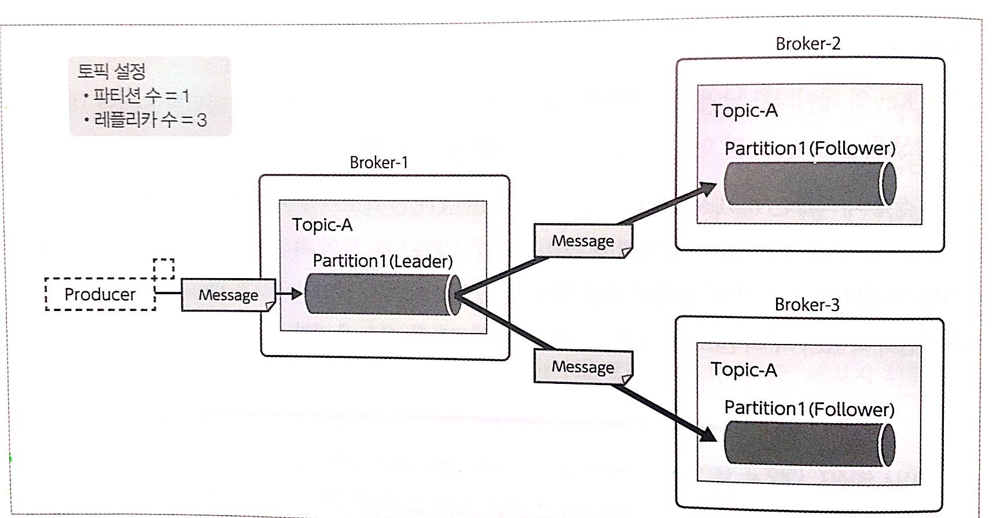
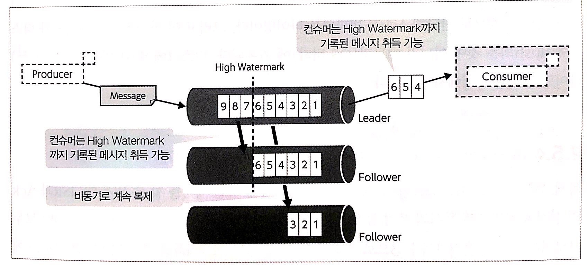

> 해당 글은 [실전 아파치 카프카](http://www.hanbit.co.kr/media/books/book_view.html?p_code=B8503179529)를 보고 정리한 내용 입니다.

# 아파치 카프카 개요

## 아파치 카프카
아파치 카프카는 여러 대의 분산 서버에서 대량의 데이터를 처리하는 분산 메시징 시스템이다. 메시지(데이터)를 받고, 받은 메시지를 다른 시스템이나 장치에 보내기 위해 사용된다.

카프카는 대량의 데이터를 **높은 처리량**과 **실시간**으로 취급하기 위한 제품으로 다음 4가지를 실현할 수 있다.
1. 확장성: 여러 서버로 확장 구성을 할수 있기 때문에 데이터 양에 따라 시스템 확장이 가능하다.
2. 영속성: 수신한 데이터를 **디스크에 유지**할수 있기 때문에 언제라도 데이터를 읽을 수 있다.
3. 유연성: 연계할 수 있는 제품이 많기 때문에 제품이나 시스템을 연결하는 허브 역할을 한다.
4. 신뢰성: **메시지 전달 보증**을 하므로 데이터 분실 걱정하지 않아도 된다.

카프카는 원래 높은 처리량으로 데이터를 실시간 처리하는 처리 성능에 초점을 두었고, 이후 기능과 신뢰성을 향샹시켜 현재는 종합 스트림 처리를 위한 플랫폼이 되고 있다.

## 카프카로 요구사항 실현하기
기존 링크드인의 요구사항을 총족시키지 못했기 때문에 카프카 개발을 시작하게 되었다. 해당 요구사항은 다음과 같다.

요구 사항
1. 높은 처리량으로 실시간 처리한다.
2. 임이의 타이밍에 데이터를 읽는다.
3. 다양한 제품과 시스템에 쉽게 연동한다.
4. 메시지를 잃지 않는다.

실현 수단
1. 메시징 모델과 스케일 아웃형 아키텍처
2. 디스크로의 데이터 영속화
3. 이해하기 쉬운 API 제공
4. 전달 보증

### 메시지 모델과 스케일 아웃
카프카에서는 다음과 같은 요구 사항을 만족시켜야 했다.

1. 높은 처리량으로 실시간 처리한다.
2. 임이의 타이밍에 데이터를 읽는다.
3. 다양한 제품과 시스템에 쉽게 연동한다.

이러한 요구 사항을 해결 하기 위해 카프카에서는 메시징 모델을 채용 했다. 일반적으로 메시징 모델은 다음 세 가지 요소로 구성된다.

* Producer: 메시지 생산자
* Brokcer: 메시지 수집/전달 역할
* Consumer: 메시지 소비자

카프카 메시징 모델을 설명하는데 있어 기존의 메시징 모델인 큐잉 모델과 Publish/Subscribe 메시징 모델 두 가지 모델을 먼저 보자. **카프카는 이 둘의 특증을 겸비한 셩태로 만들어 졌다**

#### 큐잉 모델
브로커 안에 큐를 준비해, 프로듀서에서 메시지가 큐에 담기고, 컨슈머가 큐에서 메시지를 추출한다. 하나의 큐에 대해 컨슈머가 여러개 존재하는 것을 생각할 수 있다. 이 모델은 컨슈머를 여러 개 준비함으로써 컨슈머에 의한 처리를 확장 시킬 수 있이며, 컨슈머가 메시지를 받으면 다른 컨슈머는 메시지를 받을 수 없다.

* 큐에서 여러 개의 컨슈머가 메시지를 추출할 수 있어 컨슈머에 의한 처리가 병렬로 가능하다.
* 큐에서 추출된 메시지는 컨슈머에 도달하면 사라진다. 즉 하나의 메세지는 여러 컨슈머 중 어느 하나에서 처리한다.

#### 펍/섭 메시징 모델
메시지 생산자를 프로듀서를 퍼플리셔, 메시지 소비자의 해당 컨슈머를 서브스크라이버 라고 한다.

**퍼블리셔가 서브스크라이브에게 직접 메시지를 보내는 것이 아니라 브로커를 통해 전달한다.** 퍼블리셔는 누가 메세지를 수신하는지 알수 없고 브로커에 있는 토픽이라고 불리는 카테고리 안에 메시지를 등록 시킨다.

한편 서브스크라이버는 여러 개 존재하는 톡픽 중 하나를 선책하여 메시지를 받는다. 여러 서브스크라이버가 동일한 토픽을 구독하기로 결정한다면, 이 여러 서브스크라이버는 동일한 메시지를 받는다.

* 서브스크라이버는 브로커 내의 토픽에서 자신이 흥미 있는 것을 선택한다.
* **큐잉 모델과 달리 같은 토픽을 구독하는 여러 서브스크라이버에게는 동일한 메시지가 전달된다.**

서브 스크라이버는 여러 개 존재하는 토픽 중 하나를 선택하여 메시지를 받는다. 여러 서브스크라이버가 동일한 토픽을 **구독하기로 결정한다면, 이 여러 서브스크라이버는 동일한 메시지를 받는다.**

펍/섭 메시징 모델은 TV나 라디오 전파 수신을 상상하면 이해하기 쉽다. **TV 방속국과 라디오 방송국은 개별 가정에서 누가 수신하고 있는지 고려하지 않고 방송 전파를 반신하며, 각 가정은 자신이 보고 싶은 프로그램만 선택하여 방송을 수신한다.**

#### 프로듀서/컨슈머 사이의 브로커를 끼우는 장점
큐잉 모델이든, 펍/섭 메시징 **모델이든 모두 브로커를 사이에 끼우는 형태이다.** 이 모델을 이용하면 변경에 강한 시스템 아키턱처를 만들 수 있다느 장점이 있다.

##### 프로듀서/컨슈머 모두 접속처를 하나로 할 수 있다.
프로듀서는 누구에게 메세지를 전동하면 좋을지 생각할 필요 없이 브로커로 보내기만 하면 된다. 마찬 가지로 컨슈머도 단순히 브로커에서만 수신하면 된다.

##### 프로듀서/컨슈머 증감에 대응 할 수 있다.
**프로듀서/컨슈머 모두 서로의 존재를 몰라도 되기 때문에 증감에 유연하게 대응할 수 있다.** 프로듀서를 증가시키려면 브로커에만 접속하면 되고, 컨슈머도 접속하려면 새로운 수신을 시작할 수 있다.

#### 펍섭 모델 vs 큐잉 모델
1개의 토픽에 주목한 경우 큐일 모델과 비교하면 여럿이 존재하는 모든 서브스크라이버는 동일한 메시지를 받게 된다. 병렬로 동작하는 복수의 서브스크라이버에 전달할 수 있다는 장점 이 있지만, 동일한 메세지에 대한 처리이기 때문에 브로커의 토픽에 축적되는 메시지 그룹 입장에서 보면 처리 능력을 높이는 효과는 없다. 따라서 큐잉 모델과 펍/섭 메시징 모델은 장점과 단점이 공존한다.

### 카프카 메시징 모델
카프카에서는 큐잉 모델에서 실현한 **여러 컨슈머가 분산 처리로 메세지를 소비**하는 모델과 펍/섭 메시징 모델에서 실현한 **여러 서브스크라이버에 동일한 메세지를 전달하고, 토픽 기반으로 전달 내용을 변경** 하는 모델로 되어 있다. 이 모델을 실현 하기 위해 컨슈머 그룹 이라는 개념을 도입 하여 컨슈머를 확장 구성할 수 있도록 설계계 하고 있다.

* 펍/섭 메시지 모델을 기반으로 여러 컨슈머가 분선 처리하기 위해 컨슈머 그룹이라는 개념을 도입했다.

여러 커슈머가 동일 토픽을 분산하여 메시지를 읽음으로써 처리의 확장성을 담보한다. 시스템 구성상 브로커가 1대라면 그곳이 병목이 되기도 쉽다. 따라서 **브로커도 복수 구성으로 동작하도록 되어있으며,** 결과적으로 전체적으로 확장 구성을 하고 있는 셈이다.

## 디스크로의 영속화
* 임이의 타이밍에 데이터를 읽는다.
* 메시지를 잃지 않는다. (고장에 의한 최근 메시지 손실 회피 목적은 아님)

메시지 큐에서도 데이터 영속화를 하는 제품도 있지만 실시간 접속에만 중점을 두고 있는 경우가 많으며 기본적으로 장기 보존하지 않는다. 배치 처리의 경우 데이터를 일정 기간마다 모아야 할 필요가 있기 때문에 데이터를 메모리에만 유지하는 것은 용량 면에서 불가능하다. 따라서 **카프카의 메시지 영속화는 디스크에 이루어진다. 카프카는 디스크에 영속화 함에도 불구하고 높은 처리량을 제공 한다.** 

데이터를 받아들이면서 한 묶음으로 장기 보전을 목적으로 영속화 할 수 있기 때문에 **카프카를 스토리 시스템으로도 간주 할 수 있다.**

> **카프카에서 영속화 목적**
> 
> 일반적으로 데이터 영속화라고 하면 데이터를 읽지 않은, 즉 데이터 자체에 대한 내장에성 향상을 위한 수단으로 여기는 경우가 많다. 하지만 카프카에서는 브로커의 메모리에 실리면 송신 완료(메모리에서 디스크로의 flush는 OS에 맟김)라는 사상을 가지고 있기 때문에, 카프카에 있어서 데이터 영속화는 반드시 내장애성을 의식한 것은 아니라고 할 수 있다. 카프카는 단일 브로커의 고장이 발생하더라도 즉시 데이터 손실로 이어지지 않도록 복제 구조를 갖추고 있다. 따라서 브로커 내애서의 최근 데이터 손실 방지는 메시지의 복제로 구현한다고 파악하는 것이 자연스럽다.

## 전달 보증
* 메시지를 잃지 않는다.

메세지는 생산자 입장에서 매우 당여한 요구인 메시지를 읽지 않고 전달하는 데 있어 카프카는 전달 보증 기능을 제공한다.

| 종류            | 개요            | 재전송 유무 | 중복 삭제 유무 | 비고                                         |
| ------------- | ------------- | ------ | -------- | ------------------------------------------ |
| At Most Once  | 1회는 전달시도 해본다. | X      | X        | 메시지는 중복되지 않지만 상실될 수도 있다.                   |
| At Least Once | 적어도 1회는 전달한다  | O      | X        | 메시지가 중복될 가능성은 있지만, 상실되지 않는다.               |
| Exactly Once  | 1회만 전달한다      | O      | O        | 중복돠거나 상실되지 않고 확실하게 메시지가 도달하지만, 성능이 나오기 힘들다 |

**메시지 큐에서는 `Exactly Once` 수준을 목적으로 하는 경우가 많다. 따라서 트랜잭션 관리를 위한 케커니즘이 마련돼 있다.** 그러나 카프카 개발 초기에는 성능을 중시하는, 즉 높은 처리량을 구현해야 했기 때문에 `Exactly Once` 수준의 보증은 미루고 최소한 메시지 분실 방지를 위한 `At Least Once` 수준으로 전달을 보증했다.

`At Least Once`를 실현하기 위해 Ack와 오프셋 커밋 이라는 개념을 도입하고 있다. Ack는 브로커가 메시지를 수신했을 때 프로듀서에게 수신 완료했다는 응답을 뜻한다. 이것을 이용해 프로듀서가 Ack를 받지 못한 경우 재전송을 해야 한다고 판단할 수 있다.

* 브로커가 프로듀서로부터 메시지를 **정상 수신했다면 Ack를 반환한다.**

컨슈머가 브로커로부터 메시지를 받을 때 **컨슈머가 어디까지 메시지를 받았는지를 관리하기 위한 오프셋이 있으며**, 이를 이용한 **전달 범위 보증의 구조를 오프셋 커밋**이라고 한다. 오프셋 커밋은 메시지를 받아 정상적으로 처리를 완료한 다음 오프셋을 업데이트함으로써 어딘가 잘못된 문제로 메시지를 재전송할 때도 어디부터 재전송하면 되는지 판단할 수 있다.

* 컨슈머가 수시한 메시지를 **정상 처리했다면 처리(수신) 완료 기록을 브로커에 남긴다.**

### Exactly Once 실현
초기 카프카는 `At Least Once` 수준의 전달을 보증하는 제품을 출시 했지만, 카프카의 유용성이 높아지면서 `Exactly Once` 수준의 전달을 보증하고자 하는 요구가 높아 졌다. 그러다 보니 카프카에 트랜잭션 개념을 도딥하여 전달을 보증한다.

**프로듀서와 브로커의 상호 교환 사이를 살펴보면 양쪽 모두에서 시퀀시 번호를 관리해 중복되는 실행을 제거하는 방법을 사용한다**

브로카와 컨슈머 간 교환에 있어서는 컨슈머에 대해 트랜잭션의 범위를 해석하고, **트랜잭션 중단 시 중단까지의 처리를 파기하는 기능이 있다.**

`Exactly Once` 수준의 전달을 보증하려면 카프카 뿐만 아니라 프로듀서에 해당하는 상류 시스템과 컨슈머에 해당하는 하류 시스템에도 상태 관리를 요구하게 된다. 따라서 **카프카 단독으로 전달 보증을 실현하긴 어렵다.** 하지만 **적어도 카프카는 트랜잭션 관리 메커니즘을 갖추고 있기 때문에 상류와 하류 시스템 사이에서 필요로 하는 상태 관리를 위한 조건이 갖추어지면 전달은 보증된다.**

# 카프카 기초
이 장의 주요 내용은 다음과 같다.

1. 메시지 송수신 기본
2. 시스템 구성
3. 부산 메시징을 위한 구조
4. 데이터 견고함을 담보하는 복제의 구조

**카프카를 이용한 애플리케이션 개발자나 카프카를 이용한 메시징 시스템의 사용자라면 1~3을 내용을 중심으로 파악하고,** 카프카를 이용한 플랫폼을 설계, 구축, 운용하는 엔지니어인 경우 4의 내용도 포함하여 파악하는 것이 좋다.

## 메시지 송수신 기본

* 브로커
  * 데이터를 수신, 전달하는 서비스
* 메시지
  * 카프카에서 다루는 데이터의 최소단위, 카프카가 중계하는 로그의 한 줄 한 줄과 센서 데이터 등이 이에 해당
  * 메시지는 Key, Value를 갖게 되며 메시지 전송할 때 파티셔닝에 이용됨
* 프로듀서
  * 데이터의 생산자이며 브로커에 메세지를 보내는 애플리케이션
* 컨슈머
  * 브로커에 메세지를 취득하는 애플리케이션
* 토픽
  * 메시지를 종류(토픽)별로 관리하는 스토리지, 브로커에 배치되어 관리된다.
  * 프로듀서와 컨슈머는 특정 토픽을 지정하여 메시지를 송수신함으로써 단일 카프카는 클러스터에 여러 종류의 메시지를 중계한다.

## 시스템 구성

### 브로커
브로커는 하나의 서버(또는 인스턴스) 당 하나의 데몬 프로세스로 동작하여 메시지 수신/전달 요청을 받아들인다. 이것을 여러 대의 클러스터로 구성할 수 있으며 브로커(리소스)를 추가함으로써 수신/전달의 처리향상(스케일 아웃)이 가능하다. 브로커에서 받은 데이터는 모두 디스크로 내보내기(영속화)가 이루어져 디스크의 총 용량에 따라 장기간 데이터를 보존할 수 있다.

### 프로듀서
브로커에 데이터를 송신하기 위해 구현된 애플리케이션이다. 

### 컨슈머
브로커에 메시지를 취득하도록 구현된 애플리케이션이다. 브로커는 메시지를 디스크에 영속화하기 위해 브로커에 도달하는 즉시 컨슈머에 취득해야하는 제약이 없이 디스크에 보관되어 있는 동안은 메시지 취득이 가능하다.

> **PUSH 형, PULL 형**
> 
> 카프카 시스템에서의 메시지는 **`프로듀서 -> 브로커 -> 컨슈머`** 흐름으로 이동한다. **`프로듀서 -> 브로커`의 메시지 송신은 프로듀서가 주체가 되어 브로커에게 전송하는 PUSH형이다.** 한편 **`브로커 -> 컨슈머`** 의 데이터 흐름에서 **메시지 송신 요청은 컨슈머에서의 패치 요청을 계기로 메시지가 송신된다. 즉 브로커에서 볼때 PULL 형이다**
> 
> **브로커 -> 컨슈머** 송신을 컨슈머에서 PULL 형으로 함으로써 시스템 운영상의 큰 장점은 컨슈머 시스템이 고정이나 유지보수로 정지한 경우에 브로커에 미치는 영향이 적은 것이 있다.

### 주키퍼
카프카의 브로커에 있어 분산 처리를 위한 관리 도구로 아파치 주키퍼가 필요하다.

### 카프카 클라이언트
토픽 작성 등 카프카의 동작 및 운영 상에 필요한 조작을 실행하는 서버다. **메시지 송수신을 처리하는 서버가 아니다.**

### 카프카 클러스터
카프카는 여러 대의 브로커 서버, 주키퍼 서버로 이루어진 클러스터링 메시징 중계 기능과 메시시 송수신을 위한 라이브러리그룹(Producer API / Consumer API)으로 구성된다.

## 분산 메시징을 위한 구조

### 파티션
**토픽에 대한 대량 메시지 입출력을 지원하기 위해, 브로커상의 데이터를 읽고 쓰는 것을 파티션이라는 단위로 분할되어 있다.** 토픽을 구성하는 파티션은 브로커 클러스터 안에 분산 배치되어 프로듀서에서의 메시지 수신, 컨슈머로의 배달을 분산해서 실시함으로써 하나의 토픽에 대한 대구모 데이터 수신과 전달을 지원한다.

각 파티션을 브로커에 어떻게 배치하는가에 대한 정보는 브로커 측에 유지된다. **그러기 때문에 프로듀서/컨슈머에서는 토픽만을 지정하고, 구현 시에 송신처 파티션을 의식할 필요가 없다.**

### 컨슈머 그룹
카프카는 컨슈머에서 분산 스트림 처리도 고려해 설계되어 있다. **단일 어플리케이션 안에서 여러 컨슈머가 단일 토픽이나 여러 파티션에서 메시지를 취득하는 방법으로 컨슈머 그룹이라는 개념이 존재한다.**

카프카 클러스터 전체에서 글로벌 ID를 컨슈머 그룹 전체에 공유하고 여러 컨슈머는 자신이 속한 컨슈머 그룹을 식별해, 읽어들인 파티션을 분류하고 재시도를 제어한다.

### 오프셋
각 파티션에서 수신한 메시지에는 각각 일련번호가 부여되어 있어 파티션 단위로 메시지 위치를 나타내는 오프셋 이라는 관리 정보를 이용해 컨슈머가 취득하는 메시지의 범위 및 제시도를 제어 한다.

| 용어                  | 설명                        |
| ------------------- | ------------------------- |
| Log-End-Offset(LEO) | 퍼티션 데이터의 끝을 나타낸다          |
| Current Offset      | 컨슈머가 어디까지 메시지를 읽었는가를 나타낸다 |
| Commit Offset       | 컨슈머가 어디까지 커밋했는지를 나타낸다     |

**LEO는 브로커에 의해 파티션에 관한 정보로 관리 및 업데이트 된다. Commit Offset은 컨슈머 그룹마다 보간되어 관리, 업데이트 된다.Current Offset은 컨슈머에의해 데이터 취득을 계기로 업데이트 된다.**

Commit Offset은 컨슈머로 부터 '여기까지의 오프셋은 처리했다'는 것을 확인하는 Offset Commit 요청을 계기로 업데이트 된다. **특정 토픽에 대해 여러 컨슈머 그룹이 메시지를 취득하는 경우 파티션에 대한 Commit Offset도 컨슈머 그룹 숫자만큼 존재한다.**

### 메시지 송수신
카프카에서는 송수신 처리량을 높이기 위해 어느정도 메시지를 축적하여 배치 처리로 송수신하는 기능을 제공한다.

##### 프로듀서의 메시시 송신
프로듀서가 토픽의 파티션에 메시지를 송신할 때 버퍼 기능 처럼 프료듀서의 메모리를 이용하여 일정량을 축적 후 송신할 수 있다. 데이터의 송신에 대해서는 지정한 크기까지 메시지가 축적되거나, 지정한 대기 시간에 도달하는 것 중 하나를 트리거로 전송한다.

기본 설정으로 하나의 메시지는 1회 송신되지만, 수 바이트에서 수십 바이트의 작은 메시지를 **대량으로 브로커에 송신하는 상황에서 네트워크 지연이 처리량에 영향을 주는 경우도 있어 메시지를 배치로 송신함으로써 처리량을 향상시킨다.**

#### 컨슈머의 메시지 취득
컨슈머는 취득 대상의 토픽과 파티션에 대해 Current Offset으로 나타나는 위치에 마지막으로 취득한 메시지로부터 브로커에서 보관하는 최신 메시지까지 모아서 요청 및 취득을 실시하고, 그것을 반복함으로써 계속적인 메시지 취득을 진행한다.

##### 작은 범위로 요청을 하는 경우
요청으로 하나의 메시지를 취득하는 경우 하나의 메세지 마다 Current Offset을 업데이트 한다.

##### 일정 간격을 두고 요청하는 경우

프로듀서, 컨슈머에도 어느 정도 메시지를 모아 배치 처리함으로써 처리량을 향상시키는 효과는 기대할 수 있지만 **프로듀서 송신과 컨슈머 수신 처리 지연 시간은 증가한다.** 그러므로 배치 처리의 간격에 대해서는 처리량과 대기 시간의 트레이드 오프를 고려한 설계가 필요하다.

### 컨슈머 롤백
Offset Commit의 구조를 이용해 컨슈머 처리 실패, 고장 시 롤백 메시지 재취득을 실형한다. **프로듀서에서 메시지가 송신되는 상황에서 컨슈머에 의한 데이터 취득이 2회 발생하는 시나리오로 두 번쨰 취득에서 장애가 발생한 때의 동작을 설명하고 있다.**

* (1) Offset 2까지 취득해 Offset Commit이 끝난 단계에서 Offset 3, 4, 5의 메세지를 취득 한다

* (2) 컨슈머 쪽 처리가 끝나 Offset Commit을 실행하고, Commit Offset을 5까지 진행한다.

* (3) 컨슈머 쪽에서 처리 중 Offset Commit을 실행하기 전에 컨슈머에서 장애가 발생한다.

* (4) 컨슈머가 장애에서 복구되면 Commit Offset 부터 재개 한다

* (5) 메시지를 재취득 한다.

**Commit Offset 까지 되돌아온 오프셋 간 메시지에 대한 대처는 후속 애플리케이션에 맡긴다는 점이다. 메시지를 처리 완료 생테에서 Commit Offset 업데이트 직전의 고장의 경우 동일한 메시지가 재전송되고, 메시지 중복 처리(또는 중복 허용)가 필요하다.**

**이 재시도는 Exactly Once(빠짐없이 중복이 없는 송신)가 아니라 At Least Once(최소 1번)로 송신하는 구조다. 고장 감지, 복구에 대해서도 카프카에서 제공되는 것은 아니기 때문에 Comsummer API를 이용한 애플리케이션 쪽에서 대처가 필요하다.**

다행이도 Spark Steaming 등 카프카 연계 기능을 제공하는 대부분의 분산 처리 프레임워크는 컨슈머의 고장이나 장애를 감지하여 재실항하는 메커니즘이 있으므로 일반 사용자가 감지하여 재실행하는 경우는 드물다.

### 메시지 전송 시 파티셔닝
프로듀서에서 송신하는 메시지를 어떻게 파티션으로 보낼지 결정하는 파티셔닝(분활) 기능이 제겅되고 있다. 보내는 메시지에 포함된 Key, Value 중 Key가 명시적인 지정 여부에 따라 다음 두가지 패턴 로직으로 송신된다.

#### Key의 해시 값을 사용한 송신 

**메시지의 Key를 명시적으로 지정함으로써 Key에 따라 송신처 파티션을 결정하는 로직이 된다. 동일한 Key를 가진 메시지는 동일한 ID를 가진 파티션에 송신된다.**

#### 라둔드 로빈에 의한 송신

**메시지 Key를 지정하지 않고 Null로 한 경우 여러 파티션으로의 메시지 송신을 라운드 로빈 방식으로 실행한다.**

해시에 의한 파티셔닝을 이용함으로써 동일한 Key를 가진 메시지는 동일한 컨슈머에 취득 하여 처리하는 식으로 제어할 수있다. 그러나 파티셔닝을 이용하는 경우 데이터 편차에 따라른 파티션 편향에 주의를 기울어야 한다.

## 데이터 견고성을 높이는 복제 구조
카프카는 메시지를 중계함과 동시에 서버가 고장 났을 때에 수신한 메시지를 잃지 않기 위해 복제 구조를 갖추고 있다.

파티션은 단일 또는 여러 개 레플리카로 구성되어 토픽 단위로 레플리카 수를 지정할 수 있다. 레플리카 중 하나는 Leader이며, 나머지는 Fllower라고 불린다. Follower는 그 이름대로 Leader로 부터 메시지를 계속적으로 취득하여 복제를 유지하도록 동작한다. 다판 프로듀서/컨슈머의 데이터의 교환은 Leader가 맡고 있다.

### 복제 완료 최신 오프셋

복제 사용시 오프셋 관리는 LEO 이외의 High Watermakr 라는 개념이 있다. High Watermakr는 복제가 완료된 오프셋이며, 그 성질에 반드시 Log End Offset과 동일하거나 오래된 오프셋을 나타낸다.

### 프로듀서의 메시지 도달 보증 수준
브로커에서 프로듀서로 메시지가 송신된 것을 나타내는 Ack를 어느 타이밍에 송신할 것인지를 제어하는 것은 성능과 내장애성(브로커 서버 고장 시 데이터 분실 방지)에 큰 영향을 준다.

Ack 설정 | 설명
-------|---
0 | 프로듀서는 메시지 송신 Ack를 기다리지 않고 다음 메시지를 송신한다.
1 | Leader Replica에 메세지가 전달되면 Ack를 반환한다.
ALL | 모든 ISR의 수만큼 복제되면 Ack를 반환한다.