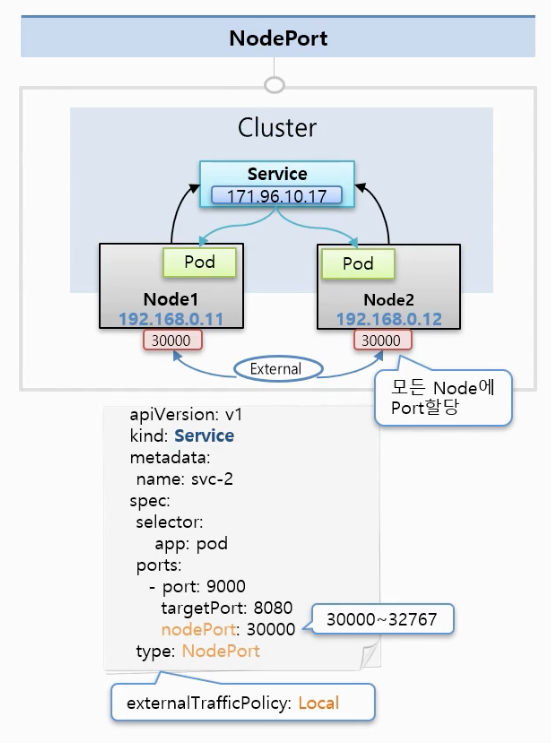
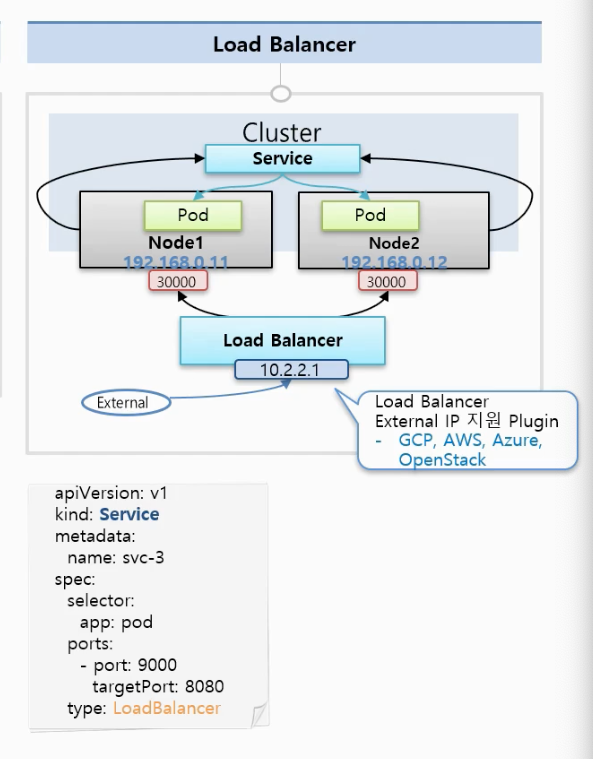

> [쿠버네티스 강의](https://kubetm.github.io/practice/beginner/gettingstarted-kubernetes/)를 보고 정리한 자료입니다.


# Object


## Container


* 컨테이너 안에 Pod이 있다
* 한 컨테이너에서 여러 Pod를 가질 수 있지만 동일한 Pod 내에서 컨테이너는 Port가 동일 할 수 없다.
* 동일한 Pod에서는 Container1 -> Container2로 접근할 때 localhost:8080으로 접근 가능
* Pod가 생성될때 고유한 아이피가 할당된다. 쿠버네티스 클러스 안에서만 해당 아이피로 접근 가능
* Pod의 문제가 있다면 시스템에서 이것을 감지하고 Pod를 삭제하고 다시 만듬, 이때 아이피가 재할당된다.

```yml
apiVersion: v1
kind: Pod
metadata:
    name: pod-1
sepc:
    containers:
        - name: container1
        image: tmkube/p8000
        ports:
            - continaerPort: 8000
        - name: container2
        image: tmkube/p8000
        ports:
            -continaerPort: 8080
        
```

## Lebel
* 라벨은 Pod 뿐만 아니라 Object도 사용 가능, 대부분 Pod에사용
* 라벨은 목적에 따라 Object를 분류하고, 그 오브젝트를 따로 연결하기 위함
* 라벨은 key, value가 한 쌍
  * type:web, lo: dev, type:db, lo: dev, type:server, lo: dev
  * type:web, lo: production, type:db, lo: production, type:server, lo: production
* 개발 환경만 보고 싶은 경우 type: dev 확인 가능
* 운영 환경만 접속하고 싶은 경우 type: production 접속 가능

## Node Schedule
* 직접선택: Pod를 만들때 node를 지정할 수 있다. 
* 스캐줄러가 판단: Pod를 만들 때 리소스의 사용량을 지정할 수 있다. 2기가 메모리를 지정, 최대 메모리 3기가 지정
* 메모리: 초과시 Pod 종료 시킴
* CPU: 초과시 request로 낮춤 over시 종료되지 않음

## Service
* Pod는 시스템 장애, 성능 장애 등 언제든지 Pod는 죽을 수 있다. 그리고 Pod는 IP는 재생성시 변경된다. Service는 사용자가 직접 지우지 않는한 제거되지 않는다. 그래서 서비스를 사용한다.
* Service 종류에 따라서 Pod에 접근하는 방식이 다르다.


### Clust IP

* Service port 9000 으로 접근하는 경우 tartgetPort 8080, 즉 Pod 8080으로 접근한다는 내용이다.
* 인가된 사용자 (운영자), 내부 대쉬보드, Pod의 서비스상태 디버깅 용으로 사용한다.

### NodePort

* Cluster에 연결된 모든 Node에서 동일한 Port가 할당되서 어느 아이피의 Port로 연결하든 서비스에 연결이 된다.
* service 어떤 노드에서 온 트래픽에 상관 없이 자신에게 달려 있는 Pod에게 트래픽을 전달한다.
  * `externalTrafficPlicy: Local`을 지정하면 특정 노드 포트에 아이피로 접근하는 Pod에 연결해준다.
* 내부망 연결, 데모나 임시 연결용

### Load Balancer

* Node Port와 동일한 성격
* Load Balancer에서 각가의 Node에 트래픽을 분산 시켜주는 역할을 한다.
  * Load Balancer의 외부 접속 IP는 기본적으로 생기지 않는다. 별도의 외부 접속 IP를 할당하는 플러그인이 설치되어야지 외부 접속 IP 할당이 가능하다.
* 외부 시스템 노출용


## Volume

### emptyDir


* 컨테이너 끼리 데이터를 공유하기 위해서 Volume을 사용 하는 경우
* 최초 Volume 생성되는 경우 Volume은 Empty이기 때문에 Empty Dir
* Container1, Container2 서로 마운트가되 있는 Volume에 저장 한다. 즉 자신의 로컬에 저장되 어있는 것 처럼 사용한다.
* 동일한 Pod에 저장되기 떄문에 Pod가 재생성되면 데이터가 제거된다. 즉 일시적인 데이터들만 저장 해야한다.

### hostPath

* 각각의 path를 각각의 volume으로 사용하는 것, 즉 각각의 Pod들이 마운트해서 공유하기 떄문에 Pod들이 죽어도 Volume은 사라지지 않는다.
* Pod 입장에서는 Pod2가 만약 죽으면 반드시 해당 노드에 재생성되는 보장이 없기 때문에 스케줄러에서 다른 Node2에서 생성되는 경우 문제가 발생할수 있다. 또 Node1 -> Node2으로 Pod가 이동될 수도 있다.


### PVC / PV

* Pod 에서 PSV를 거쳐서 PV를 접속하는 이유
  * 

## 참고
* [강의 자료](https://kubetm.github.io/practice/beginner/gettingstarted-kubernetes/)