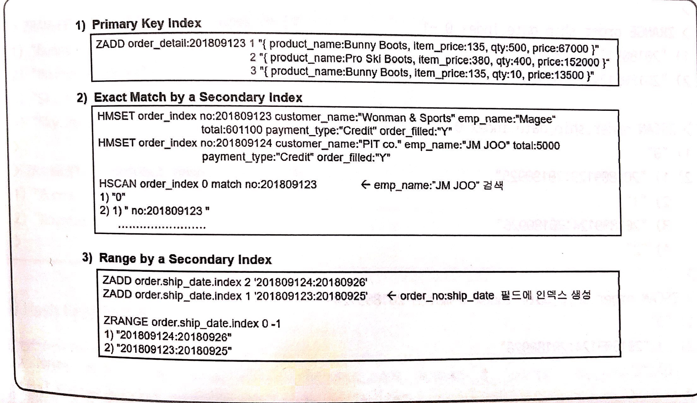
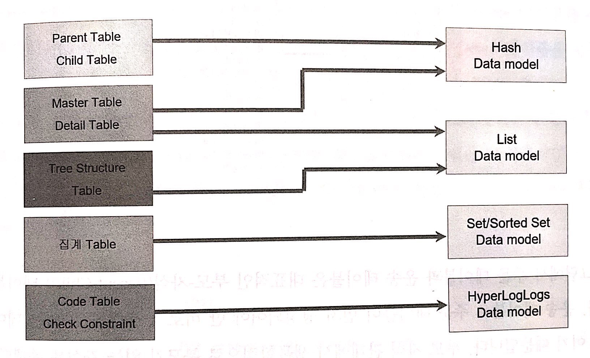
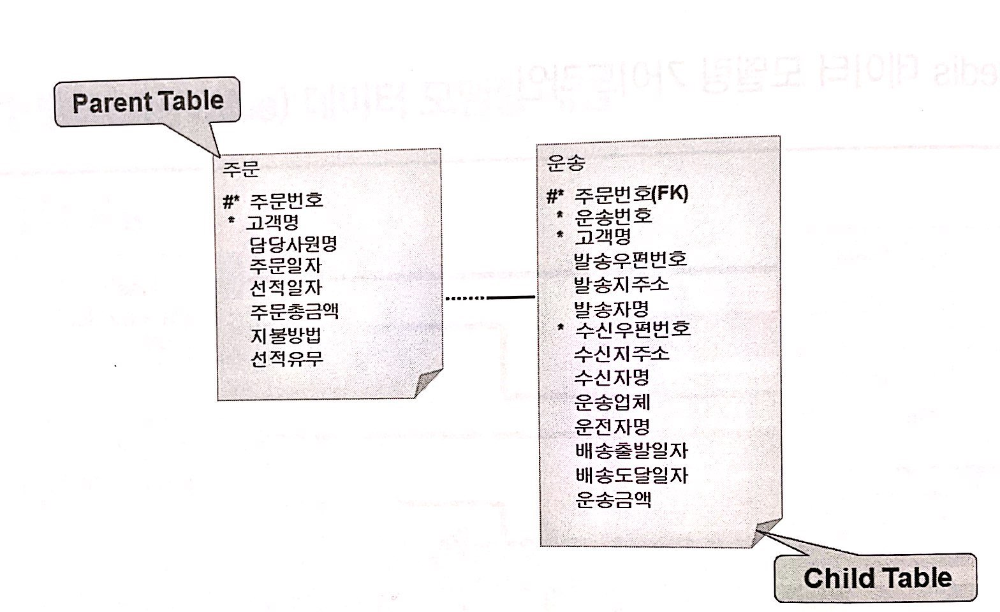
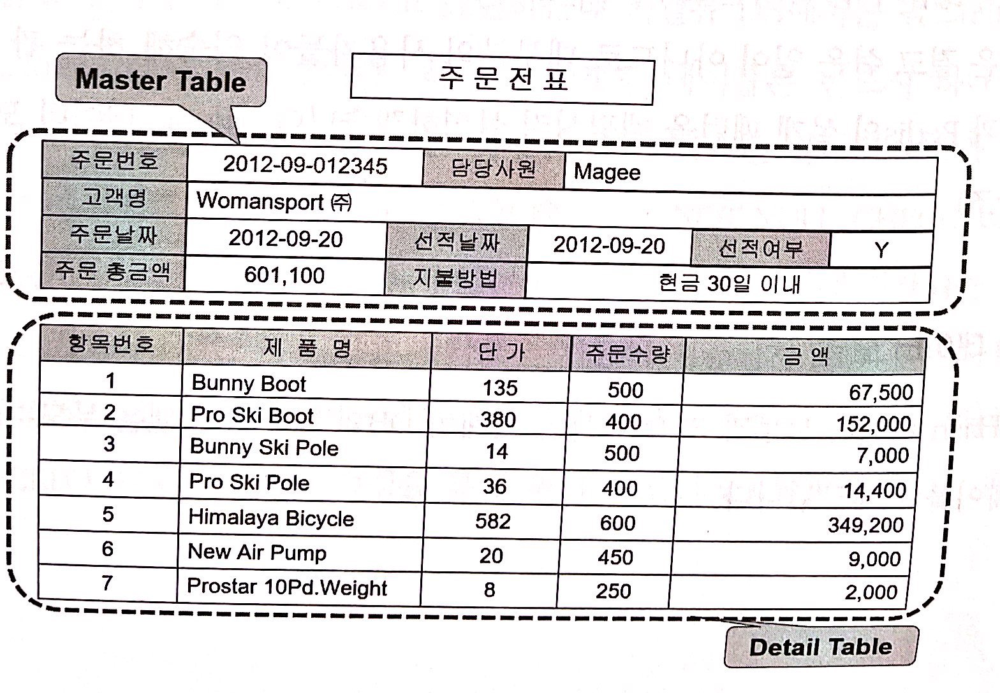

> [빅데이터 저장 및 분석을 위한 NoSQL & Redis](http://m.yes24.com/goods/detail/71131862) 내용 정리

# 2 Redis 설치 및 데이터 처리

```
$ docker pull redis
$ docker run --name redis-study -d -p 6379:6379 redis
$ docker run -it --link redis-study:redis --rm redis redis-cli -h redis -p 6379
```


## 데이터 처리

### 용어 설명


용어 | 설명
---|---
Table | 하나의 DB에사 데이터를 저장하는 논리적인 구조
Data Sets | 테이블을 구성하는 논리적 단위입니다. 하나의 데이터-셋은 하나의 KEY와 한 개 이상의 `FIELD/ELEMENT`로 구성됩니다.
Key | 하나의 KEY는 하나 이상의 조합된 값으로 표현 가능합니다. 예를들어 주문번호 또는 주문번호+순번, 년월일+순번
Values | 해당 Key에 대한 구체적인 데이터를 값으로 펴햔합니다. 벨류는 하나 이상의 `Field, Element`로 구성됩니다.

### 데이터 입력/수정/삭제/조회

종류 | 내용
---|---
set | 데이터를 저장할때(key, value)
get | 저장된 데이터를 검색할 때
rename | 저장된 데이터 값을 변경할 때
randomKey | 지정된 Key 중에 하나의 Key를 랜덤하게 검색할 때
Keys | 지정된 모든 Key를 검색할 때
exits | 검색 대상 Key가 존재하는지 여부를 확인할 때
mset/mget | 여러 개의 Key와 Value를 한번 저장하고 검색할 때

Redis DB에 데이터를 입력/수정/삭제/조회 하기 위해서는 반드시 Redis 서버에서 제공하는 명령어를 사용해야 하며 데이터를 조장할 때는 Key에 대한 하나 이상의 Field 또는 Element로 표현해야합니다.


### 실습

```
redis:6379> set 1111 "Yun" # 해당 키값으로 벨류 저장
redis:6379> get 1111 # 해당 키에대한 데이터 검색
redis:6379> keys * # 저장되어 있는 모든 key 출력
redis:6379> keys *2 # 저장되어 있는 key 중에 2로 끝나는 key 검색 
redis:6379> rename 1111 1112 # key 1111 -> 1112 변경
redis:6379> rename 1111 1112 # key 1111 -> 1112 변경
redis:6379> randomkey # 현재 key중에서 랜덤 key 검색
redis:6379> exists 1116 # 키존재 여부 존재하는 경우 1
redis:6379> strlen 1111 # 해당 키 값의 value 길이길이
redis:6379> flushall # 저장되어 있는 모든 key 삭제
redis:6379> setex 123 30 "asd" # 일정시간 동안만 저장
redis:6379> ttl 123 # 현재 남아있는 시간
redis:6379> mset 111 "111" 123 "123" # 여러 개 필드를 한 번에 저장
redis:6379> mget 111 123 # Mset에 저장된 값을 한번에 다중 검색
1) "111"
2) "123"
redis:6379> mget 111 123 11 noneexisting # 존재하지 않는 경우 nil 출력
1) "111"
2) "123"
3) (nil)
4) (nil)
redis:6379> append 111 "asdasd" # 현재 value에 value 추가
(integer) 9
redis:6379> get 111
"111asdasd"
redis:6379> save # 현재 입력한 key/value 값을 파일로 저장
OK
redis:6379> info # Redis 서버 설정 상태 조회
# Server
redis_version:6.2.1
...

```

### 데이터 타입

종류 | 내용
---|---
strings | 문자, Binary 유형 데이터를 저장
List | 하나의 Key에 여러 개의 배열 값을 저장
Hash | 하나의 Key에 여러 개의 Fields와 Value로 구성된 테이블을 저장
Set / Sorted set | 정령되지 않은 String 타입 / Set과 Hash를 결합한 타입
Bitmaps | `0,1`로 표현하는 데이터 타입
HyperLogLogs | Element 중에 Unique 한 개수의 Element 만 계산
Geospatial | 좌표 데이터를 저장 및 관리하는 데이터 타입


#### Hash 타입


하나의 Key와 하나 이상의 `Field/Element` 값으로 저장할 수 있습니다. Value에는 기본적으로 Strings 데이터를 저장할 수 있으며 추가로 컨테이너 타입의 데이터들을 저장할 수 있습니다.

타입의 데이터들은 저장할 수 있습니다. 컨테이너 타입에는 Hash, List, Set/Sorted Set 4가지 유형이 있습니다. 다음 설명은 Hash에 대한 설명입니다.

* Hash 타입은 기존 관계형 DB에서 Primary-key와 하나 이상의 커럶으로 구성된 테이블 구조와 매우 흡사한 데이터 유형입니다.
* 하나의 Key는 오브젝트명과 하나 이상의 필드 값을 콜론 `:` 기호로 결합하여 표현할 수 있습니다. ex order:201809123, order_detial:201809123:01
* 문자 값을 저장할 때는 잉용부호를 `""`를 사용하여 숫자 값을 저장할 때는 잉용부호가 필요하지 않습니다
* 기본적으로 필드 개수는 제한 없습니다.
* Hash 타입의 데이터를 처리할 때는 `hmset`, `hget`, `hgetall`, `hkey`, `hlen` 명령어를 사용합니다.

#### 실습


```
$ hmset order:201809123 customer_name "Woman & Sports" emp_name "Manage" total 601100 peyment_type "Credit" order_filled "Y" ship_date 20180925
# Hash 타입은 하나의 Key에 여러 개의 field와 value를 저장할 수 있음

$ hget order:201809123 customer_name
"Woman & Sports"
# hget order:201809123 key에 대한 customer_name 필드와 value 값 검색

$ hget order:201809123 ship_date
"20180925"
# hget order:201809123 key에 대한 ship_date 필드와 value 값 검색

$ hgetall order:201809123
 1) "customer_name"
 2) "Woman & Sports"
 3) "emp_name"
 4) "Manage"
 5) "total"
 6) "601100"
 7) "peyment_type"
 8) "Credit"
 9) "order_filled"
10) "Y"
11) "ship_date"
12) "20180925"
# order:201809123 모든 key에 대한 모든 필드와 value 값 검색

$ hexists order:201809123 product_name
(integer) 0
# product_name 필드가 존재하는지 여부 확인

$ hkeys order:201809123
1) "customer_name"
2) "emp_name"
3) "total"
4) "peyment_type"
5) "order_filled"
6) "ship_date"
# order:201809123 키에 대한 모든 필드명 출력

$ hvals order:201809123
1) "Woman & Sports"
2) "Manage"
3) "601100"
4) "Credit"
5) "Y"
6) "20180925"
# order:201809123 키에 대한 모든 


$ hmget order:201809123 emp_name total
1) "Manage"
2) "601100"

해당 Key에 정의된 특정 필드의 value만 출력
```

#### List 타입


* List 타입은 기존의 관계형 테이블에 존재하지 않은 데이터 유형이며 일반적인 프로그래밍 언어에서 데이터를 처리할 때 사용되는 배열 변수와 유사한 데이터 구조입니다.
* 기본적으로 String 타입의 경우 배열에 저장할 수 있는 데이터 크기는 512M 입니다.
* List 타입의 데이터를 처리할 때는 `lpush`, `lrange`, `rpus`, `rpop`, `llen`, `lindex` 명령어를 사용 합니다.

#### 실습

```
$ lpush order_detail:201809123 "<item_id>1</item_id><product_name>Bunny Boots</product_name><item_price>135</item_price><qty>500</qty><price>67000</price>" "<item_id>2</item_id><product_name>Pro Ski Boots</product_name><item_price>380</item_price><qty>400</qty><price>152000</price>"

$ lpush order_detail:201809123 "<item_id>3</item_id><product_name>ProSki Boots</product_name><item_price>380</item_price><qty>10</qty><price>13500</price>"
# 기존 저장된 데이터의 오른쪽(마지막 인덱스) 부분에 새로운 value 저장

$ rpop order_detail:201809123
# 가장 마지막 인덱스에 저장된 value 제거

$ lrange order_detail:201809123 0 10 
# 0~10 index 값 조회

$ llen order_detail:201809123
# 저장된 value의 count

$ lindex order_detail:201809123 0
# index에 저장된 데이터 검색
```

#### Set 타입


* List 타입은 하나의 필드에 여러 개의 배열 값을 저장할 수 있는 데이터 구조라면 Set 타입은 배열 구조가 아닌 여러 개의 엘리먼트로 데이터 값을 표현하는 구조입니다.
* Set 타입의 데이터를 처리할 때는 `sadd`, `smembers`, `scard`, `sdfiff`, `sunion` 명령어를 사용 합니다.

#### 실습

```
$ SADD product "id:11, product_name:Sky Pole, item_price:55, qty: 100, price:5500" "id:12, product_name:Bunny Boots, item_price:135, qty: 500, price:67000"

$ SADD product "id:13, product_name:Pants, item_price:10, qty: 200, price:2000"

$ SMEMBERS product
1) "id:13, product_name:Pants, item_price:10, qty: 200, price:2000"
2) "id:1, product_name:Bunny Boots, item_price:135, qty: 500, price:67000"
3) "id:11, product_name:Sky Pole, item_price:55, qty: 100, price:5500"
# product에 저장되어 있는 Element 조회

$ SCARD product
(integer) 3
# 저장된 value 개수

# SADD product_old "id:91, product_name:Old Sky Pole"

$ SDIFF product_old product
1) "id:91, product_name:Old Sky Pole"
# product와 product_old 중에 product_old에 만 있는 value 

$ SDIFFSTORE product_diff product prodct_old
# prodct와 product_old 중에 product에 만 있는 value Sets를 product_diff에 저장

$ SUNION product product_old
# product와 product_old를 union한 결과

$ SUNIONSTORE product_new product product_old
# union한 결과를 product_new에 저장

$ SREM product_new "id:11, product_name:Sky Pole, item_price:55, qty: 100, price:5500"
$ 지정해서 제거

$ SADD product.id.index 1 13

```

#### Sorted Set 타입

* Sorted Set 타입은 Set 타입과 동일한 데이터 구조이며 차이점은 저장된 데이터 값이 분류된 상태이며 Sorted Set 타입이고 분류되지 않으면 Set 타입입니다.
* 데이터를 처리할 때는 `zadd`, `zrange`, `zcard`, `zacount`, `zrank`, `zrevrank` 명령어를 사용합니다.


#### Bit 타입

* 일반적으로 사용자가 표현하는 데이터는 문자, 숫자, 날짜인데 이를 Ascii 값이라고 표현하는데 컴퓨터는 이를 최종적으로 0,1로 변환하여저장합니다. Redis에서 제공되는 Bit 타입은 사용자의 데이터를 0,1로 표현하며 컴퓨터가 가장 빠르게 저장할 수 있도록 해석할 수 있도록 표현하는 구조입니다.
* 데이터를 처리할 때는 setbit, gebit, bitaccount 명령어릂 사용합니다.

##### Geo 타입

* Redis DB의 Geo 타입은 위치정보 데이터를 효율적으로 저장 관리할 수 있으며 이를 활용한 위치 정보 데이터 분석 및 검색에 사용할 수 있습니다.
* 데이터를 처리할 때는 `geoadd`, `gerpops`, `geodist`, `georadius`, `geohash` 명령어를 사용합니다.

##### HyperLogLogs 타입

* HyperLogLogs 타입은 관계형 DB의 테이블 구조에서 Check 제약조건과 유사한 개념의 데이터 구조입니다. 관계형 DB에서 check 제약조건을 사용하는 이유는 해당 칼럼에 반드시 저장되오야 할 데이터 값 만을 저장할 수 있또록 제한을 가하는 것입니다. Redis DB에서도 동일하게 특정 필드 또는 엘리먼트에 저장되오야 할 데이터 값을 미리 생성하여 저장한 후 필요에 따라 연결하여 사용할 수 있는 데이터 타입입니다.
* 데이터를 처리할 때는 `pfadd`, `pfcount`, `pfmerge` 명령어를 사용합니다.

## Redis 확장 Module

많은 개발자들이 Redis Server의 소스를 이용한 다양한 기능들을 개발하여 배포하게 되었는데 이를 Redis 확장 모듈 이라고 합니다. 


* REJSON: JSON 데이터 타입을 이요한 데이터를 처리할 수 있는 모듈
* RedisSQL: Redis Server에서 SQLite(관계형 DB)로 데이터를 저장할 수 있는 모듈
* RedisSearch: Redis DB 내에 저장된 데이터에 대한 검색엔진을 사용할 수 있는 모듈

# 트랜잭션 제어 & 사용자 관리

NoSQL로 분류되는 모든 제품이 트랜잭션을 제어할 수 있고 일관성과 공유 기능을 제공하는 것은 아닙니다. 맣은 제품들 중에 관계형 DB의 Commit, Rollback 명령어처럼 트랜젝션 제어가 가능한 제품이 몇되지 않은데 그 중 하나가 Redis 입니다. **하지만 관계형 DB 처럼 Commit, Rollback을 수해앟게 되면 초딩 100,000 ~ 200,000건 이상 데이터의 쓰기와 읽기 작업에 좋은 성능을 기대할 수는 없게 되는 문제점이 발생하게 되는데 이를 보완하기 위해 Redis는 Read Committed 타입의 트랜잭션 제어 타입도 제공하고 있습니다.**

일반적으로 관계형 DB 또는 대부분의 NoSQL 기술은 위 그림처럼 5가지 유형의 락-메커니즘을 제공하는데 Redis 4.0 버전은 데이터-셋 레벨의 락 메커니즘을 제공하고 있습니다.

## CAS (Check and Set)

```
> WATCH         -> 다중 트랜잭션 모니터링 시작
> MULTI         -> 트랜잭션 시작
OK              
> Set 1 jmjoo   
QUEUED          -> 임시 저장
> Sest 2 yhjoo  
QUEUED          -> 임시 저장
>
> EXEC          -> 트랜잭션 종료
Error ....
```
**하나의 트랜잭션에 의해 데이터가 변경되는 시점에 다른 트랜잭션에 의해 동일한 데이터가 먼저 변경되는 경우 일관성에 문제가 발생할 수 있다.** Redis는 이ㅘ 같은 경우 `Watch` 명령어에 의해 트랜잭션을 취소할 수 있습니다.

데이터 일관성과 공유(동일한 데이터를 동시 여러 명의 사용자가 수정, 삭제 하는 경우 발생하는 충돌을 피하기 위한 기술)을 위해서 동시 처리가 발생할 때 먼저 **작업을 요구한 사용자에게 우선권을 보장하고 나중에 작업을 요구한 사용자의 세션에서는 해당 트랜잭션에 충돌이 발생했음을 인지할 수 있도록 해야하는데 이를 Redis DB에서는 CAS 라고 합니다.**


### 실습

```
redis:6379> WATCH a # 다중 트랜잭션이 발생하는지 여부를 모니터링 시작함
OK
redis:6379> MULTI # 트랜잭션 시작
OK
redis:6379(TX)> Set 1 jmjoo
QUEUED # 임시 저장
redis:6379(TX)> Set 2 yhjoo
QUEUED # 임시 저장
redis:6379(TX)> EXEC # 트랜잭션 종료
1) OK
2) OK
```

## commit & rollback

Redis 서버에서 트랜잭션을 사용자가 직접 제어하는 방법입니다. 변경한 데이터를 최종 저장할 때 EXEC, 취소할 때 DISCARD 명령어를 실행합니다.

```
redis:6379> WATCH a
OK
redis:6379> MULTI
OK
redis:6379(TX)> Set 1 jmjoo
QUEUED
redis:6379(TX)> Set 2 yhjoo
QUEUED
redis:6379(TX)> EXEC # 트랜잭션 Commit
1) OK
2) OK

redis:6379> FLUSHALL # 데이터 초기화
redis:6379> MULTI
OK
redis:6379> Set 3 jmjoo
QUEUED
redis:6379> Set 4 yhjoo
QUEUED
>
> DISCARD # 트랜잭션 Rollback
OK
```

## Index 유형 및 생헝



Redis DB는 기본적으로 하나의 Key와 하나 이상의 Field/Element 값으로 구성되는데 **해당 Key에 빠른 검색을 위해 기본적으로 인덱스가 생성됩니다. 이를 Primary Key Index라고 합니다. 또한 사용자의 필요에 따라 추가적인 인덱스를 생성할 수 있는데 이를 Secondary Index라고 합니다.**


인덱스 키를 통해 검색할 때 유일한 값을 검색하는 경우에 `Exact Match By a Secondary Index`라고 하며 일정 범위의 값을 검색 조건으로 부여하는 경우를 `Range By Secondary Index` 라고합니다.

### Sorted Set 타입 인덱스

```
redis:6379> ZADD order.ship_date.index 2 '201809124:20180926'
(integer) 1
redis:6379> ZADD order.ship_date.index 2 '201809123:20180925' # order 테이블, order_no:ship_date 필드에 인덱스 생성
(integer) 1
redis:6379> ZRANGE order.ship_date.index 0 -1
1) "201809123:20180925"
2) "201809124:20180926"
redis:6379> ZSCAN order.ship_date.index 
1) "0"
2) 1) "201809123:20180925"
   2) "2"
   3) "201809124:20180926"
   4) "2"
```

## 사용자 생성 및 인증/보안/Roles

### Access Control 권한
* DBMS의 가장 보편적인 인증 방식으로 미리 사용자 계정과 암호를 생성한뒤 이 계정명과 암호를 정확히 입력하면 사용자를 이증하는 방식 ex `vi redis.config`, `requirepass manager`
* Redis에 접속할때 Access Control을 선탳갛ㄹ 수 있습니다. `vi config`, `masterauth redis123`

### OS 인증 & Internal 인증
* Redis에서는 해당 시스템의 IP-Address로만 접속을 허용하는 Network 인증 방식을 제공합니다. `vi redis.conf`, `bind_ip 192,168.0.10`
* Auth command를 이용하여 인증하는 방법입니다. `auth manager`

# Redis Data Modeling

## 키-벨류 데이터 모델링 개념

### 용어 설명


관계형 DB에서 데이터를 저장하는 논리적 구조를 테이블 이라고 펴한하는 것 처럼 키벨류 DB에서도 테이블 이라고 합니다. 하나의 테이블을 구성하고 있는 요소들을 칼럼이라고 표현하는데 키벨류 DB에서는 필드 또는 엘리먼트라고 표현합니다. 하나의 관계형 테이블은 반드시 하나의 식별키의 필드 또는 엘리먼트로 구성됩니다. 관계형 테이블은 NOT NULL, CHECK, UNIQUE와 같은 제약조건을 통해 원치않은 데이터가 특정 칼럼에 지정되는것을 방지할 수 있지만 키벨류 DB는 이와 같은 케약조건 기능을 제공되지 않고 있습니다. 다만 관계형 DB에서 CHECK 조건을 만족하는 데이터 만을 저장장 하기 위해 사용되는 것처럼 키벨류 DB는 `HYPRELOGLOGS` 데이터 속성을 통해 조건의 데이터를 저장, 관리할 수 있습니다. 

### Redis 데이터 모델링 가이드라인



#### Hash 데이터 모델



Redis의 Hash 데이터 모델과 가장 유사한 관계형 DB의 데이터 모델은 부모-자식 테이블에 해당됩니다. 운송 테이블은 주문 테이블이 먼저 생성되어야 만 비로서 생성될 수 이쓴ㄴ 데이터 구조이기 때문입니다. 즉 부모가 있어야만 자식이 존재할 수 있는 구조입니다. 이런 데이터 관계를 Redis에서는 Hash 모델을 사용합니다.

#### List 모델 테이블 



관계형 DB의 모델은 마스터-디테일 테이블에 해당 됩니다. 위 그림처럼 주문전표를 관계형 DB의 분석/설계 과정을 거치면 주문 공통 테이블과 주문 상세 테이블로 설계할 수 있는데 이 과 같은 구조를 마스터-디테일 관계 테이블 이라고 합니다. **이과 같은 데이터 관계를 Redis DB에서 구현할 때 `Hash-List` 모델을 선택합니다.**


#### Set/Sorted 데이터 모델


Redis의 Set/Sorted Set 데이터 모델과 가장 유사한 관계형 DB의 데이터 모델은 계층형 테이블에 해당 됩니다. 위 그름에서 사원 테이블은 사원번호가 식별-키이며 상관사원번호 칼럼은 같은 테이블 내에 식별-키인 사원번호를 참조하는 관계형 구조를 가지고 있습니다. 이와 같은 데이터 구조를 관계형 DB에서 `Self-Reference` 관계형 테이블이라고 표현하는데 Redis DB에서 구현할 때 `Set/Sorted Set` 모델을 선택하시면 됩니다.


#### HperLongLogs 데이터 모델

Redis에 `HperLongLogs` 데이터 모델과 가장 유사한 관게형 DB의 데이터 모델은 Check-제약조건에 해당됩니다. 일반적으로 관계형 테이블의 특정 칼럼에 제한된 값만 정해야 하는 경우 3가지 방법을 통해 구현할 수 있습니다. 애플리케이션에서 데이터를 조정하는 방법, 특종 조건 데이터 값을 임의의 테이블에 미리 저장한 이후 해당 테이블에 데이터를 입력 및 수정할 때 임이의 테이블과 식별키와 외부키로 검증하는 방식 입니다. 임시 테이블을 만드는 방식이 `HperLongLogs`dhk rkxdms qkdtlrdlqslek.


### 데이터 모델

Redis 서버에서 설계할 수 있는 데이터 모델 유형은 크게 5가지가 있습니다. 

1. Hash-Hash Data Model
2. Haash-List Data Model
3. List-List Data Model
4. Set/Sorted Set List Data Model
5. HyperLogLogs Data Model

#### Hash-Hash Data Model


위 그림과 같은 구조를 Redis DB의 Hash-Hash 데이터 모델로 표현할 수 있습니다.

```
redis:6379> hset order:201809123 customer_name "Woman & Sports" emp_name "Message" total 60110 payment_type "Credit" order_filled "Y"
(integer) 5
redis:6379> hgetall order:201809123
 1) "customer_name"
 2) "Woman & Sports"
 3) "emp_name"
 4) "Message"
 5) "total"
 6) "60110"
 7) "payment_type"
 8) "Credit"
 9) "order_filled"
10) "Y"
redis:6379> hmset translate:2020180912320 translate_no 672310 customer_name "Woman & Sports" zip_code 15881 address "Seoul Songpa 58" order_amount 60100
OK
redis:6379> hgetall translate:2020180912320
 1) "translate_no"
 2) "672310"
 3) "customer_name"
 4) "Woman & Sports"
 5) "zip_code"
 6) "15881"
 7) "address"
 8) "Seoul Songpa 58"
 9) "order_amount"
10) "60100"
```

hmset translate:2020180912320 translate_no 672310 customer_name "Woman & Sports" zip_code 15881 address "Seoul Songpa 58" order_amount 60100